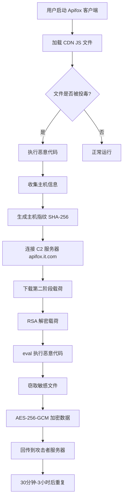

## 1. 事件概述

2026年3月，国内流行的API协作平台 Apifox 遭遇了一起严重的**供应链投毒攻击**。攻击者通过篡改官方 CDN 托管的 JavaScript 文件，在桌面客户端中植入恶意代码，意图窃取开发者的核心凭证并实施远程控制。

此次攻击从 **2026年3月4日** 开始，持续活跃了 **18天**，直到3月22日恶意域名才停止解析。由于 Apifox 被广泛应用于研发团队，此次事件的影响范围极广，Windows、macOS 和 Linux 平台用户均受影响。

### 1.1 事件时间线

| 日期 | 事件 |
|------|------|
| 2026年3月4日 | 攻击者篡改 Apifox 官方 CDN 上的 JS 文件，投毒攻击开始 |
| 2026年3月4日-22日 | 恶意代码持续分发，攻击者迭代攻击载荷 |
| 2026年3月22日 | 恶意域名 `apifox.it.com` 下线，停止解析 |
| 2026年3月23日 | Apifox 发布 v2.8.19 修复版本 |
| 2026年3月25日 | 安全研究人员披露事件，Apifox 官方发布安全公告 |

### 1.2 为什么这个事件很重要？

与传统的病毒传播不同，此次攻击属于典型的**供应链攻击**。攻击者并未直接攻击用户，而是选择入侵 Apifox 的官方软件分发渠道，在用户毫不知情的情况下，将恶意代码"合法"地分发到受害者的电脑中。

开发者的电脑中存储着通往企业核心资产的"钥匙"：
- SSH 私钥 → 直接登录生产服务器
- Git Token → 访问和修改代码仓库
- 云服务 Access Key → 控制云基础设施
- 数据库密码 → 访问敏感数据

一把泄露的密钥，可能导致整个企业内网被渗透。

---

## 2. 技术深度分析

### 2.1 攻击环境：Electron 框架的安全缺陷

Apifox 桌面客户端基于 **Electron 框架**开发，存在以下安全问题：

| 问题 | 说明 | 后果 |
|------|------|------|
| 未启用 sandbox | 渲染进程可访问 Node.js API | 前端 JS 可执行系统命令 |
| Node.js API 暴露 | 可直接调用 `fs`、`child_process`、`os` 等模块 | 文件读写、命令执行、信息收集 |

**核心漏洞点**：由于未严格启用沙盒（Sandbox），通过网络加载的恶意 JS 代码获得了本地 Node.js 环境的完整权限，可以直接读写本地文件系统和执行系统命令。

### 2.2 投毒机制

#### 被篡改的文件

```
URL: https://cdn.apifox.com/www/assets/js/apifox-app-event-tracking.min.js
正常大小: 约 34KB
恶意大小: 约 77KB
```

攻击者在原本用于事件追踪的 SDK 代码末尾，追加了约 **42KB** 的高度混淆恶意代码。

#### CDN 信息

```
cdn.apifox.com → CNAME → qiniudns.com（七牛云 CDN）
```

关于投毒发生位置，目前存在两种可能：
1. **CDN 节点被篡改**：部分 CDN 节点上的文件被替换
2. **链路劫持**：HTTPS 通信过程中被中间人篡改（但需绕过证书校验）

### 2.3 恶意域名

攻击者注册了极具迷惑性的域名：

```
apifox.it.com
```

这个域名模仿了官方域名格式，旨在绕过用户和部分安全软件的警惕。

---

## 3. 攻击链完整流程

### 3.1 攻击流程图



### 3.2 攻击阶段详解

#### 第一阶段：投毒文件下发

Apifox 桌面客户端在启动时，会动态加载事件追踪脚本。攻击者在该文件末尾追加了高度混淆的恶意代码。当用户启动被投毒的客户端时，这段恶意代码便随之激活。

#### 第二阶段：建立连接与载荷加载

恶意代码激活后：

1. **收集主机信息**：
   - 主机名
   - 用户名
   - MAC 地址
   - CPU 型号
   - 操作系统版本

2. **生成唯一标识**：
   ```
   SHA-256(mac + cpu + hostname + user + os)
   ```

3. **连接 C2 服务器**：
   向 `apifox.it.com` 发送请求，获取第二阶段恶意载荷。

4. **解密执行**：
   使用内嵌的 RSA-2048 私钥解密载荷，通过 `eval()` 函数执行。

#### 第三阶段：核心数据窃取

第二阶段脚本会系统性地扫描并窃取以下敏感文件：

| 类型 | 路径 | 风险 |
|------|------|------|
| SSH 私钥 | `~/.ssh/id_rsa` 等 | 直接登录服务器 |
| Git 凭证 | `~/.git-credentials` | 访问代码仓库 |
| 命令行历史 | `~/.bash_history`、`~/.zsh_history` | 可能包含明文密码 |
| K8s 配置 | `~/.kube/*` | 控制 Kubernetes 集群 |
| npm 凭证 | `~/.npmrc` | 访问私有包仓库 |
| 云 Access Key | 各种云服务商配置 | 控制云基础设施 |

所有窃取的数据会被打包、使用 **AES-256-GCM** 加密，然后回传到攻击者的服务器。

### 3.3 通信特征

- **低频 Beacon**：30分钟到3小时之间随机间隔
- **加密通信**：使用 RSA-2048 加密载荷
- **隐蔽传输**：自定义请求头，伪装正常流量

---

## 4. 影响范围

### 4.1 受影响的版本

- **受影响版本**：Apifox SaaS 版桌面客户端 **2.8.19 以下版本**
- **受影响平台**：Windows、macOS、Linux 全平台
- **受影响时间**：2026年3月4日至3月22日

### 4.2 不受影响的版本

- Web 版（浏览器访问）
- 私有化部署版
- v2.8.19 及以上版本

### 4.3 为什么开发者是高危目标？

攻击者的目标并非个人电脑中的照片或文档，而是开发者手中通往企业核心资产的"钥匙"：

```
开发者电脑 → SSH密钥 → 生产服务器
           → Git Token → 代码仓库
           → 云密钥 → 云基础设施
           → 数据库密码 → 敏感数据
```

开发者的电脑因此成为了攻击者**横向移动**、**渗透企业内网**的绝佳跳板。

---

## 5. 自查指南

### 5.1 Windows 用户

打开 PowerShell（管理员），执行：

```powershell
Select-String -Path "$env:APPDATA\apifox\Local Storage\leveldb\*" -Pattern "rl_mc","rl_headers" -List | Select-Object Path
```

### 5.2 macOS 用户

打开终端，执行：

```bash
grep -arlE "rl_mc|rl_headers" ~/Library/Application\ Support/apifox/Local\ Storage/leveldb
```

### 5.3 Linux 用户

打开终端，执行：

```bash
grep -arlE "rl_mc|rl_headers" ~/.config/apifox/Local\ Storage/leveldb
```

### 5.4 结果判断

- **有输出具体文件** → 已中招，需要立即采取补救措施
- **无输出** → 可能未被感染，但仍建议执行防护措施

> **注意**：由于被检查的文件为缓存文件，存在假阴性可能。如果在攻击窗口期（3月4日-22日）曾使用过 Apifox 桌面客户端，有极大概率已遭到攻击。

---

## 6. 防护与处置措施

### 6.1 立即升级客户端

这是阻断攻击最直接有效的方法。

```
修复版本：v2.8.19 及以上
修复方式：废除在线动态加载 JS，改为本地内置打包
```

### 6.2 全面轮换敏感凭证

这是处置措施中**最关键**的一步。你必须假设所有在受影响设备上存储过的凭证均已泄露。

#### 必须重置的凭证

| 凭证类型 | 操作 |
|---------|------|
| SSH 密钥 | 生成新密钥对，部署到所有服务器和代码托管平台 |
| Git Token | 吊销并重新生成所有 Personal Access Token |
| 云服务密钥 | 轮换 AWS、阿里云、腾讯云等的 Access Key |
| 数据库密码 | 修改所有本地或远程数据库的访问密码 |
| API Key | 检查并更换所有第三方服务 API Key |
| K8s Token | 重新生成 Kubernetes 集群访问凭证 |

#### SSH 密钥重置示例

```bash
# 备份旧密钥
mv ~/.ssh/id_rsa ~/.ssh/id_rsa.old
mv ~/.ssh/id_rsa.pub ~/.ssh/id_rsa.pub.old

# 生成新密钥
ssh-keygen -t ed25519 -C "your_email@example.com"

# 将新公钥部署到服务器
ssh-copy-id user@server
```

### 6.3 网络层面封禁

在网络层面封禁以下可疑域名：

```
apifox.it.com
cdn.openroute.dev
upgrade.feishu.it.com
system.toshinkyo.or.jp
ns.feishu.it.com
```

### 6.4 检查服务器日志

审查服务器登录日志，检查是否有异常 SSH 登录：

```bash
# 查看最近的 SSH 登录记录
last -a | head -20

# 查看认证日志
grep "Accepted" /var/log/auth.log | tail -20
```

---

## 7. 安全启示

### 7.1 供应链攻击的特点

1. **隐蔽性强**：恶意代码混淆加密，难以察觉
2. **自动执行**：客户端启动即触发，无需用户交互
3. **概率性触发**：并非每次请求都返回恶意版本
4. **精准定向**：明确针对开发人员的高价值资产
5. **高权限运行**：利用框架漏洞获取系统级权限

### 7.2 开发者安全最佳实践

#### 客户端安全

- ✅ 及时更新软件到最新版本
- ✅ 启用软件的安全沙盒功能
- ✅ 定期检查软件的完整性（校验 Hash）
- ✅ 使用官方渠道下载软件

#### 凭证管理

- ✅ 使用 SSH 密钥而非密码认证
- ✅ 为不同服务使用不同的密钥
- ✅ 定期轮换敏感凭证
- ✅ 使用密钥管理工具（如 1Password、Bitwarden）

#### 网络安全

- ✅ 配置防火墙规则
- ✅ 监控异常网络流量
- ✅ 封禁可疑域名
- ✅ 使用 DNS 过滤服务

#### 代码安全

- ✅ 启用双因素认证（2FA）
- ✅ 使用 Personal Access Token 而非密码
- ✅ 定期审查代码仓库的访问权限
- ✅ 启用代码提交签名验证

### 7.3 Electron 应用开发建议

如果你是 Electron 应用开发者，请注意：

```javascript
// ✅ 启用沙盒
const win = new BrowserWindow({
  webPreferences: {
    sandbox: true,
    contextIsolation: true,
    nodeIntegration: false,
    preload: path.join(__dirname, 'preload.js')
  }
});

// ❌ 避免这样做
const win = new BrowserWindow({
  webPreferences: {
    nodeIntegration: true,
    contextIsolation: false
  }
});
```

- 启用 `sandbox` 和 `contextIsolation`
- 禁用 `nodeIntegration`
- 使用 `preload` 脚本安全地暴露必要 API
- 避免从网络动态加载可执行代码
- 实施内容安全策略（CSP）

---

## 8. 总结

Apifox 供应链投毒事件是一次针对开发者的精准攻击，利用了 Electron 框架的安全缺陷和 CDN 分发机制的漏洞。此次事件提醒我们：

1. **供应链安全至关重要**：任何依赖的第三方组件都可能成为攻击入口
2. **开发者是高危目标**：手中掌握着企业核心资产的访问权限
3. **及时更新是关键**：保持软件最新状态能有效防范已知漏洞
4. **凭证管理不可忽视**：定期轮换密钥，最小化泄露影响

如果你曾在风险时间段（2026年3月4日至3月22日）使用过 Apifox 桌面客户端，请**立即**执行本文提到的排查和处置措施。

---

## 参考资料

- [Apifox 官方安全公告](https://docs.apifox.com/8392582m0)
- [微步情报局分析报告](https://developer.aliyun.com/article/1726660)
- [华中科技大学网络安全提示](https://ncc.hust.edu.cn/info/1443/6691.htm)
- [CSDN 深度分析报告](https://blog.csdn.net/m0_71099018/article/details/159691630)
