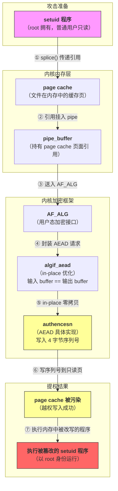
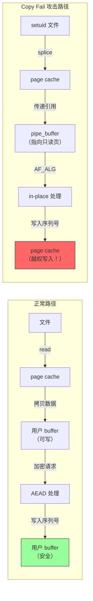

## 1. 漏洞效果：越权写入 page cache

CVE-2026-31431 提权漏洞的影响效果可以理解为，让一个普通用户在没有写权限的情况下，临时改掉了系统内存里某些本不该被修改的文件内容，然后借助这个机会，通过任意代码执行获得 root 权限。

正常情况下，文件有权限保护，普通用户无法写入高权限敏感目录，修改系统命令或者高权限的程序。

问题在于，Linux 为了让系统跑得快一些，在用户需要读文件的时候，并不会每次都去硬盘上重新读一遍。在文件被频繁访问时，它会把文件放进内存缓存里，也就是 page cache。程序运行时，很多时候读到的其实是内存里的这个 page cache，可以理解为文件在内存中的映射或缓存表示。

Copy Fail 漏洞的关键在于攻击者没有改硬盘上的文件，却改到了内存缓存里的文件内容，也就是这个缓存表示，最终成功完成了攻击。

> **通俗类比**：把系统想象成图书馆，系统里的真正文件（原稿）放在库房里，普通读者只能看，不能改。为了方便读取，管理员把常用书复印了一份放在阅览室。正常规则应该是读者只能看复印件，也不能改复印件。
>
> 这次的漏洞，可以看作系统在某个流程里把只能看的复印件误当成了可以涂写的草稿纸，于是读者虽然没有权限改库房里的原书，也没有权限改这个只读的复印件，但实际上却成功修改了这份复印件，完成了越权写入。

## 2. 第一个核心机制：setuid

Linux 系统里有一些特殊程序，普通用户可以运行，但运行时会临时带有 root 权限，表面上看普通用户可以更高权限工作，有点像越权，但这是经过系统信任的。

这里如果展开讲，那就涉及 Linux 权限模型中的一个核心机制 setuid。

在 Linux 中，有一类程序，普通用户可以运行，但运行时会临时拥有程序文件所有者的权限，通常是 root。

最典型的例子，就是 passwd。用户修改密码，本质上需要写 `/etc/shadow`，这个文件只有 root 能写。解决办法就是 passwd 程序本身由 root 拥有，并设置 setuid 位。用户运行它时，这个程序在执行过程中具备 root 权限。

系统认为这些程序是可信的，因为普通用户无法修改它们。不过，也就是这一点信任模型被攻击者利用了。

Copy Fail 的攻击思路在于，先把这类程序在内存里的缓存表示改掉，再让系统执行它。系统以为自己执行的是原来的可信程序，实际跑的是被临时动过手脚的内存版本，结果普通用户就可能拿到 root 了。

## 3. 第二个核心机制：splice

为什么系统会把只读内存数据当成可写入内容呢？

更准确点说，其核心原理在于避免数据拷贝，直接传递对内存页的引用。

Linux 读取文件时，通常不会每次都直接访问磁盘，因为磁盘很慢，但是内存很快，所以内核会把文件内容按页缓存到内存中，这就是 page cache。一个文件被读过之后，它的内容可能已经存在于 page cache 里。下一次再读这个文件时，内核可以直接从 page cache 取数据。

此外，因为内核空间和用户空间是隔离的，而 page cache 位于内核管理的内存区域，所以当用户程序在程序调用 `read(fd, buf, len)` 正常读取文件时，内核要做的就是从 page cache 找到对应文件页，再把这些字节复制到用户提供的 buf 里。

数据路径是先从磁盘文件 → page cache，然后 page cache → 拷贝 → 用户空间 buffer。如果文件已经在 page cache 中，第一步可以省掉，但第二步仍然需要，因为这是内核和用户程序之间的安全边界。

这一步的目的主要在于安全方面，那就是用户程序不能直接修改内核缓存页，但代价就是每次都要复制数据，性能会受影响。

于是 Linux 提供了一类零拷贝机制，其中一个就是 `splice()` 机制，目的是在内核内部搬运数据时尽量避免复制。

在普通的 `read()` 流程中，数据会从 page cache 拷贝到用户空间 buffer。如果程序只是想把文件内容转发给另一个内核对象，比如 pipe、socket 或加密接口，那么这次先拷贝到用户空间、再从用户空间交回内核，就很浪费。

`splice()` 的设计目标就是绕过这个过程，它可以把文件内容直接接入一个 pipe，让后续内核模块继续消费这份数据。

具体来讲，`splice()` 会把 page cache 中的文件页挂到 pipe 的缓冲区结构上，这个结构叫做 `pipe_buffer`。`pipe_buffer` 里有一个字段指向某个 `struct page`。`struct page` 是 Linux 内核用来描述物理内存页的核心结构。对于文件读取场景来说，这个 `struct page` 对应的就是 page cache 中保存文件内容的那一页。

也就是说，本来正常的读取应该是「page cache → 拷贝 → 用户空间 buffer」，但 `splice()` 没有拷贝 page cache，只把 page cache 挂在 `pipe_buffer` 上，`pipe_buffer` 本身也没有保存一份新的文件数据，其只保存了一个对 page cache 页面的引用。

**数据没有被复制，仅仅是被引用了。** 后续如果把这个 pipe 交给其他内核模块，比如网络或加密接口，这些模块操作的其实是原始 page cache 页面。

这个设计本身是合理的。只要后续模块把这份数据当成只读输入，就不会有问题。

但问题就在于，后续模块不一定只读。

## 4. 第三个核心机制：内核加密接口 AF_ALG

Linux 内核里有一套密码学框架，供内核模块使用。为了让用户态程序也能调用这些能力，Linux 提供了 AF_ALG。它是一种 socket 地址族，用户程序可以通过类似 socket 的方式，把数据交给内核做哈希、加密、解密或认证。

Copy Fail 漏洞涉及的是其中的 AEAD 类型。

AEAD 是「Authenticated Encryption with Associated Data」的缩写，中文可以理解为「带关联数据认证的加密」。它同时解决两个问题：数据加密和数据完整性认证。

在 AEAD 里，数据通常分成两部分，一部分是需要加密的数据，也就是真正的明文或密文内容。另一部分叫 associated data，简称 AD。它不一定需要加密，但需要参与认证。比如在网络协议里，某些头部字段可以明文存在，但接收方仍然要确认这些字段没有被篡改。

用户可以把数据提交给 AF_ALG，让内核执行加密、解密或认证操作，Copy Fail 利用的就是这个路径，把来自 `splice()` 的 page cache 数据送进内核处理链。

## 5. 第四个核心机制：algif_aead

当数据进入 AF_ALG 后，会先交由 algif_aead 处理，其将用户通过 AF_ALG 提交的数据，封装成 AEAD 请求，然后交给具体实现，比如 authencesn。

在正常设计中，加密流程是先输入 buffer（只读） → 内核处理 → 输出 buffer（可写）。

但是，在 2017 年的一个内核改动中，algif_aead 引入了一种性能优化机制，叫 **in-place 操作**，这个操作允许输入和输出共用同一块内存，从而减少一次拷贝。

这个优化带来了一个明显的隐患，那就是，在 in-place 下，内核假设调用方提供的是**可写 buffer**。

对于普通用户空间 buffer，这个假设是成立的。但在 Copy Fail 场景中，这块内存来自 `splice()`，实际指向的是 page cache。

## 6. 第五个核心机制：authencesn（真正的漏洞点）

authencesn 可以拆开理解。authenc 表示「认证 + 加密」的组合模式，esn 表示 Extended Sequence Number，也就是扩展序列号，其比较常用于类似 IPsec ESP 这样的协议场景，协议需要同时处理加密数据、认证数据和序列号相关字段。

在这个处理过程中，authencesn 需要构造认证输入。为了让底层哈希或认证算法计算正确，它会在某个位置写入一个序列号字段。这个字段是 4 字节，也就是 32 bit。位置大致是：`offset = 关联数据长度 + 加密数据长度`。

在原本设计中，这个写入应该落在输出 buffer 或临时工作区里。因为输出 buffer 是可写的，所以写 4 字节没有问题。

关键在于，algif_aead 启用了 in-place 处理，在 in-place 的优化下，**输入 buffer == 输出 buffer**。

如果这块 buffer 是普通用户内存，写入仍然可控。如果这块 buffer 来自 `splice()` 机制，它实际指向 `pipe_buffer`，而 `pipe_buffer` 是对 page cache 页面的引用。于是 authencesn 的 4 字节写入就落到了文件缓存页 page cache 上。

**这就是漏洞真正发生的地方**，源自于内核假设 buffer 可写，但实际上传入的是只读 page cache，由此导致了写操作污染文件缓存，造成越权写入。

其中，还有一个隐蔽的细节，那就是，这个 4 字节的写入，发生在 authencesn 对认证 tag 做校验**之前**。也就是说，即使攻击者提交的数据无法通过认证、内核最终返回 EBADMSG 报告解密失败，page cache 的污染也已经完成了。攻击者不需要构造一个合法的 AEAD 密文，失败的解密请求本身就足以触发写入。

> **一句话总结**：内核以为自己在写一个可写的 AEAD 输出缓冲区，实际写到的是只读文件的 page cache。

## 7. 完整攻击链

所以，整个攻击过程大概就是：

1. 攻击者首先选择一个自己可以读取、但没有写权限的文件。这个文件可能是某个 setuid 程序。普通权限模型下，攻击者只能读它，不能改它。
2. 攻击者通过 `splice()` 机制把这个文件的一部分内容接入 pipe。此时 pipe 里的 `pipe_buffer` 指向的是该文件在 page cache 中对应的 `struct page`。在这个地方，数据没有复制，pipe 持有的是页面引用。
3. 攻击者把这个 pipe 中的数据交给 AF_ALG。在内核看来，这只是一段待处理的 AEAD 输入数据。
4. algif_aead 按照 in-place 逻辑处理它。
5. 这里出问题的关键是，内核没有把来自 `splice()` 的 page cache 页面和普通可写用户 buffer 区分开来处理，导致后续的悲剧——越权写入。
6. AEAD 请求进入 authencesn。authencesn 为了构造认证数据，在计算出来的位置写入 4 字节的序列号字段。这个位置理论上属于可写输出区域，但是，由于前面的悲剧，导致这次写入实际上落在了 `pipe_buffer` 引用的 page cache 页面上。
7. 结果就是，原本只读文件在内存中的缓存页被改了 4 个字节。

**不要小瞧四个字节**，在二进制程序里，少量字节就可能改变指令、跳转、条件判断或数据结构。如果攻击者能控制文件偏移和写入位置，就可能把 setuid 程序在内存中的行为改成自己想要的样子。此外，攻击者可以重复发起请求，每次写入不同偏移，从而对 setuid 程序的内存镜像做多处精准修改。

最后，攻击者执行这个 setuid 程序。系统仍然认为它是 root 拥有的可信程序，因为磁盘文件没有被改，权限也没有变。但执行时命中的内容已经是 page cache 中被越权修改的版本，于是攻击者就有机会获得 root 权限。

## 8. Living off the Land

整个过程中，攻击者没有写磁盘，没有改变文件权限，也没有留下传统意义上的文件篡改痕迹，这就是所谓的 **Living off the Land（LotL）**，属于不修改磁盘文件的内存级攻击方式，也不会触发依赖文件系统事件的安全监控工具。

## 9. 五条机制串联总结

| 机制 | 作用 |
|------|------|
| setuid | 使得普通用户程序在执行时以 root 权限运行 |
| `splice()` | 使得传递过程为 page cache 页面的引用，而非其拷贝 |
| AF_ALG | 把用户提供的数据交给内核加密框架处理 |
| algif_aead | in-place 优化假设输入和输出可以共用一个可写内存 |
| authencesn | 实现会在处理过程中写入一个 4 字节字段 |

这样下来，实现结果就是：对于一个普通用户，authencesn 修改了该程序在 page cache 中的内存映像，并以 root 权限执行了这个程序。

## 10. 防护措施

防护上最核心的就是**更新内核**，取消 algif_aead 的 in-place 逻辑，恢复输入和输出分离，避免写入落在输入 buffer 上。

如果无法升级，那就先限制 AF_ALG 接口，禁用相关模块。

当然了，最一劳永逸的治本方法，自然还是打上内核补丁。
