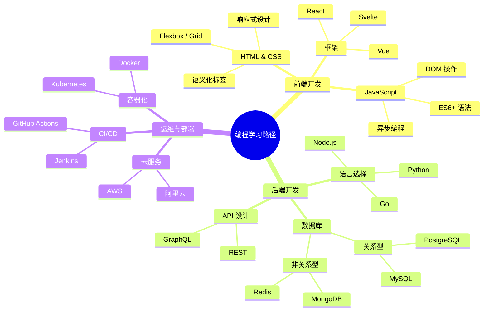
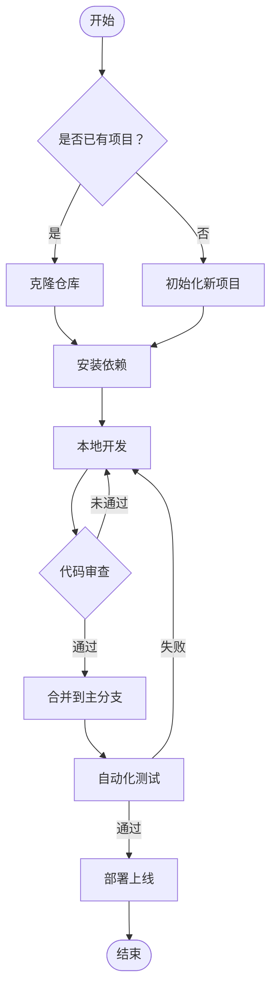
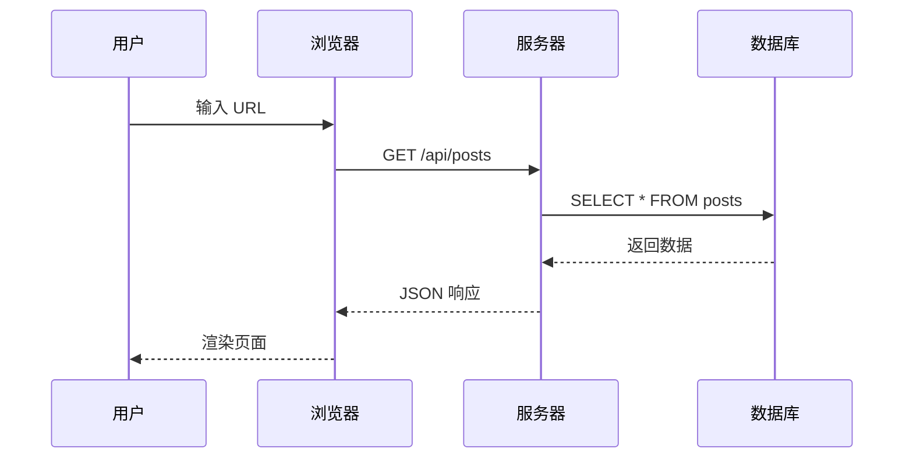
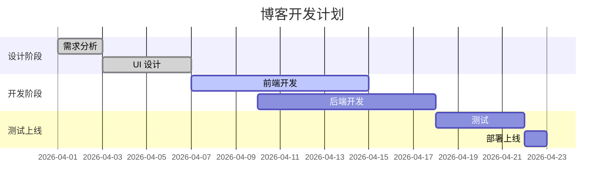
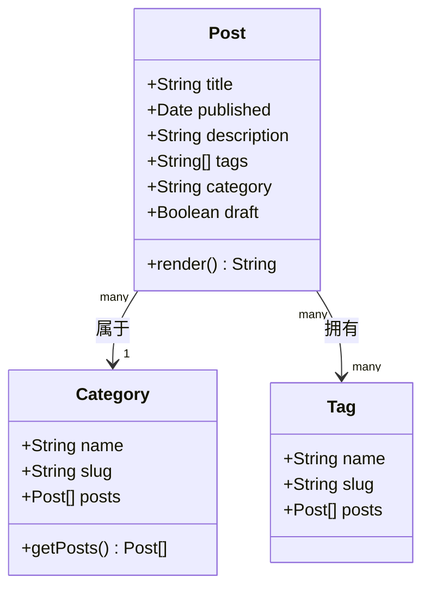

## 什么是 Mermaid？

[Mermaid](https://mermaid.js.org/) 是一种基于 Markdown 语法的图表绘制工具，只需在代码块中写几行文字，即可生成流程图、思维导图、时序图等多种图表。

在 Markdown 中使用 ` ```mermaid ` 代码块即可启用。

---

## 思维导图



---

## 流程图



---

## 时序图



---

## 甘特图



---

## 类图



---

## Mermaid 语法速查

| 图表类型 | 关键字 | 用途 |
|---------|--------|------|
| 思维导图 | `mindmap` | 概念发散、知识梳理 |
| 流程图 | `flowchart` / `graph` | 流程描述、决策树 |
| 时序图 | `sequenceDiagram` | 交互流程、API 调用 |
| 甘特图 | `gantt` | 项目计划、时间线 |
| 类图 | `classDiagram` | 数据结构、UML |
| 状态图 | `stateDiagram-v2` | 状态机、生命周期 |
| 饼图 | `pie` | 数据占比 |
| ER 图 | `erDiagram` | 数据库设计 |
