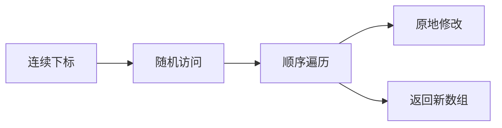

## 概述

数组是最常用的数据结构：它把一组元素按顺序放在连续的逻辑位置上，并通过下标进行访问。无论是前端列表渲染、表格数据处理、还是算法题里的区间扫描，数组几乎都是第一层抽象。

理解数组的关键，不只是会调用 `push`、`map`、`filter`，而是知道：

- 下标访问为什么快；
- 插入、删除为什么可能慢；
- 遍历时如何维护状态；
- 什么时候应该原地修改，什么时候应该返回新数组。

> 前置知识
> - **下标访问**：数组通过位置定位元素
> - **动态数组**：理解扩容、移动和摊还复杂度
> - **遍历模型**：读写指针是数组原地处理的基础

---

## 问题定义

数组适合表示“顺序稳定、可通过位置定位”的数据集合。

| 需求 | 数组是否适合 | 原因 |
| --- | --- | --- |
| 通过下标读取第 k 个元素 | 适合 | 随机访问直接定位 |
| 频繁在末尾追加 | 适合 | 动态数组通常摊还 O(1) |
| 频繁在头部插入/删除 | 不适合 | 后续元素需要整体移动 |
| 保持有序并二分查找 | 适合 | 下标可直接访问中点 |
| 表示链式关系 | 不一定 | 链表或 Map 可能更自然 |

在 JavaScript / TypeScript 中，数组是动态数组：长度可以变化，元素也可以是任意类型。但在算法分析里，我们仍然按“连续下标 + 顺序存储”的模型理解它。

---

## 核心原理：分步图解

假设数组为：

```text
index:  0   1   2   3
value: 10  20  30  40
```

### 访问元素

读取 `arr[2]` 时，只需要通过下标定位到第 2 个位置：

```text
index:  0   1   2   3
value: 10  20 [30] 40
```

所以随机访问是 O(1)。

### 中间插入

如果要在下标 1 插入 `15`，原来的 `20、30、40` 都要向后移动：

```text
插入前: 10 20 30 40
移动后: 10 _  20 30 40
插入后: 10 15 20 30 40
```

移动元素的成本与尾部长度有关，因此中间插入最坏是 O(n)。

### 双指针原地修改

数组还常用于“读写指针”模型：一个指针扫描原数组，另一个指针维护写入位置。

```text
read  -> 扫描每个元素
write -> 指向下一个有效元素位置
```

这类技巧能把很多“过滤、去重、压缩”问题从额外 O(n) 空间优化为 O(1) 额外空间。

---

## 基本操作与复杂度

| 操作 | 示例 | 时间复杂度 | 说明 |
| --- | --- | --- | --- |
| 随机访问 | `arr[i]` | O(1) | 通过下标定位 |
| 修改元素 | `arr[i] = x` | O(1) | 不改变数组结构 |
| 末尾追加 | `arr.push(x)` | 摊还 O(1) | 扩容时会有额外成本 |
| 末尾删除 | `arr.pop()` | O(1) | 不移动前面的元素 |
| 头部插入 | `arr.unshift(x)` | O(n) | 需要移动所有元素 |
| 中间删除 | `arr.splice(i, 1)` | O(n) | 需要移动后续元素 |
| 遍历 | `for ...` | O(n) | 每个元素访问一次 |
| 排序 | `arr.sort()` | 通常 O(n log n) | 取决于运行时实现 |

工程中最容易忽略的是 `shift` 和 `unshift`。它们看起来简单，但在大数组上可能比 `push` / `pop` 慢很多。

---

## TypeScript 实现

下面用一个“有序数组去重”的例子，把数组的访问、遍历、原地写入串起来。

### 1. 原地去重

```typescript
function removeDuplicates(nums: number[]): number {
  if (nums.length === 0) return 0;

  let write = 1;

  for (let read = 1; read < nums.length; read++) {
    if (nums[read] !== nums[read - 1]) {
      nums[write] = nums[read];
      write++;
    }
  }

  return write;
}

const nums = [1, 1, 2, 2, 3, 4, 4];
const len = removeDuplicates(nums);
console.log(nums.slice(0, len)); // [1, 2, 3, 4]
```

这里的关键不变量是：

- `[0, write)` 区间始终保存已经确认的唯一元素；
- `read` 负责向右扫描候选元素；
- 当发现新值时，把它写到 `write` 位置。

### 2. 合并两个有序数组

```typescript
function mergeSorted(left: number[], right: number[]): number[] {
  const result: number[] = [];
  let i = 0;
  let j = 0;

  while (i < left.length && j < right.length) {
    if (left[i] <= right[j]) {
      result.push(left[i]);
      i++;
    } else {
      result.push(right[j]);
      j++;
    }
  }

  while (i < left.length) result.push(left[i++]);
  while (j < right.length) result.push(right[j++]);

  return result;
}
```

这个实现展示了数组的另一个常见模型：两个下标分别在两个序列上移动，结果数组按顺序追加。

---

## 工程优化：原地还是新数组

数组操作通常有两种风格：

| 风格 | 示例 | 优点 | 代价 |
| --- | --- | --- | --- |
| 原地修改 | `sort`、`splice`、双指针写入 | 节省空间 | 容易影响调用方持有的引用 |
| 返回新数组 | `map`、`filter`、`slice` | 更安全、更适合不可变状态 | 需要额外空间 |

在前端状态管理中，通常倾向返回新数组，因为 React 等框架依赖引用变化判断是否更新：

```typescript
const nextTodos = todos.filter(todo => !todo.completed);
```

在算法或性能敏感场景中，原地修改更常见，因为它能减少额外内存：

```typescript
nums.sort((a, b) => a - b);
```

选择标准不是“哪个更高级”，而是当前场景更看重可读性、不可变性，还是空间效率。

---

## 应用与局限

### 典型应用

- 列表渲染、分页、排序和过滤；
- 双指针、滑动窗口、前缀和等数组算法；
- 矩阵、堆、并查集等结构的底层存储；
- 批量请求结果、日志记录、表格数据处理。

### 局限性

- 中间插入和删除成本高；
- 稀疏数组会让行为变得不直观；
- `sort` 默认按字符串排序，数字排序必须传比较函数；
- 大数组频繁复制会带来明显的内存压力。

---

## 总结



- 数组的核心优势是下标访问和顺序遍历。
- 插入、删除的成本主要来自元素移动。
- 双指针是数组原地处理问题的基础模型。
- 工程中要区分原地修改和返回新数组两种风格。
- 掌握数组，才能更自然地理解二分、滑动窗口、前缀和等算法。
