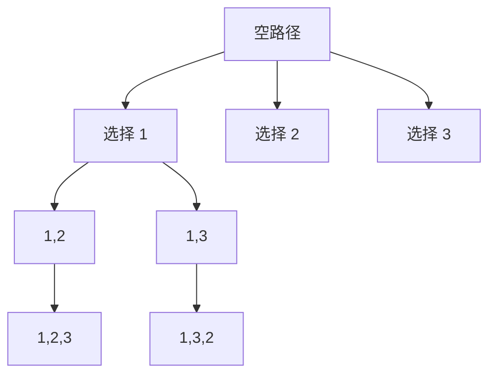
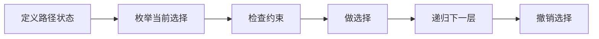

## 概述

**回溯算法（Backtracking）** 是一种在决策树上进行深度优先搜索的枚举方法。它会尝试一个选择，继续向下搜索；如果当前路径不满足条件，就撤销选择，回到上一层尝试其他分支。

> 前置知识
> - **DFS**：回溯本质上是深度优先遍历决策树
> - **递归**：用调用栈保存每一层选择状态
> - **剪枝**：提前跳过不可能产生答案的分支

---

## 问题定义

给定一组选择空间，枚举所有满足约束的解，并在搜索过程中避免无效分支。

| 要素 | 说明 |
|------|------|
| 输入 | 候选元素、目标长度、目标和或棋盘约束 |
| 输出 | 所有满足条件的路径、组合、排列或布局 |
| 关键状态 | 当前路径、可选范围、已使用标记、约束判断 |
| 典型问题 | 全排列、组合、子集、组合总和、N 皇后 |

---

## 核心原理：分步图解

以 `[1, 2, 3]` 的全排列为例，每一层选择一个尚未使用的数字：



回溯的核心动作可以拆成三步：

1. **做选择**：把候选元素加入当前路径。
2. **继续搜索**：递归进入下一层决策。
3. **撤销选择**：恢复现场，让同一层可以尝试下一个候选。

如果把所有路径都看作一棵树，回溯就是“沿一条路走到底，再退回来换路”。

---

## 算法精细步骤

```
算法：Backtrack(path, choices)
输入：当前路径 path，可选集合 choices
输出：所有满足条件的解

1. 如果 path 已满足结束条件：
2.     复制 path 到结果集
3.     返回
4. 遍历 choices 中的每个 choice：
5.     如果 choice 不满足约束，跳过
6.     将 choice 加入 path
7.     更新选择状态
8.     Backtrack(path, nextChoices)
9.     撤销 choice 和状态更新
```

**复杂度分析**：

| 问题类型 | 搜索规模 | 说明 |
|------|------|------|
| 排列 | O(n × n!) | n! 个排列，每个结果复制 O(n) |
| 组合 | O(k × C(n,k)) | 只枚举长度为 k 的路径 |
| 子集 | O(n × 2^n) | 每个元素选或不选 |
| N 皇后 | 近似 O(n!) | 剪枝后远小于暴力 n^n |
| 空间复杂度 | O(n) + 输出 | 递归深度和当前路径为 O(n) |

---

## TypeScript 实现

### 1. 全排列

```typescript
function permute(nums: number[]): number[][] {
  const result: number[][] = [];
  const path: number[] = [];
  const used = new Array(nums.length).fill(false);

  function backtrack(): void {
    if (path.length === nums.length) {
      result.push([...path]);
      return;
    }

    for (let i = 0; i < nums.length; i++) {
      if (used[i]) continue;
      used[i] = true;
      path.push(nums[i]);
      backtrack();
      path.pop();
      used[i] = false;
    }
  }

  backtrack();
  return result;
}
```

### 2. 组合

```typescript
function combine(n: number, k: number): number[][] {
  const result: number[][] = [];
  const path: number[] = [];

  function backtrack(start: number): void {
    if (path.length === k) {
      result.push([...path]);
      return;
    }

    for (let i = start; i <= n - (k - path.length) + 1; i++) {
      path.push(i);
      backtrack(i + 1);
      path.pop();
    }
  }

  backtrack(1);
  return result;
}
```

### 3. 子集

```typescript
function subsets(nums: number[]): number[][] {
  const result: number[][] = [];
  const path: number[] = [];

  function backtrack(start: number): void {
    result.push([...path]);

    for (let i = start; i < nums.length; i++) {
      path.push(nums[i]);
      backtrack(i + 1);
      path.pop();
    }
  }

  backtrack(0);
  return result;
}
```

### 4. N 皇后

```typescript
function solveNQueens(n: number): string[][] {
  const result: string[][] = [];
  const board = Array.from({ length: n }, () => new Array(n).fill('.'));
  const cols = new Set<number>();
  const diag1 = new Set<number>();
  const diag2 = new Set<number>();

  function backtrack(row: number): void {
    if (row === n) {
      result.push(board.map(line => line.join('')));
      return;
    }

    for (let col = 0; col < n; col++) {
      if (cols.has(col) || diag1.has(row - col) || diag2.has(row + col)) continue;
      cols.add(col);
      diag1.add(row - col);
      diag2.add(row + col);
      board[row][col] = 'Q';

      backtrack(row + 1);

      board[row][col] = '.';
      cols.delete(col);
      diag1.delete(row - col);
      diag2.delete(row + col);
    }
  }

  backtrack(0);
  return result;
}
```

---

## 工程优化：剪枝与状态隔离

回溯代码最容易出错的地方是状态复用。工程中可以从三点优化：

| 优化点 | 做法 | 价值 |
|------|------|------|
| 剪枝条件前置 | 先判断剩余元素是否足够、当前和是否超限 | 减少无效递归 |
| 状态成对修改 | `push` 和 `pop`、`add` 和 `delete` 成对出现 | 避免污染其他分支 |
| 复制结果 | 收集答案时使用 `[...path]` | 防止后续回溯改动已保存结果 |

N 皇后中用 `cols / diag1 / diag2` 三个集合替代逐格扫描，可以把每次合法性判断从 O(n) 降到 O(1)。

---

## 应用与局限

### 典型应用

- 排列、组合、子集等枚举问题
- 棋盘搜索：N 皇后、数独
- 路径搜索：迷宫路径、单词搜索
- 约束满足问题：括号生成、电话号码字母组合

### 局限性

| 局限 | 说明 |
|------|------|
| 搜索空间大 | 多数回溯问题本质是指数级 |
| 容易状态污染 | 忘记撤销选择会导致结果错误 |
| 递归深度受限 | 深度过大时可能触发调用栈限制 |

---

## 总结



**核心要点**：

1. 回溯 = DFS + 状态选择 + 撤销选择。
2. 排列用 `used` 控制重复使用，组合和子集用 `start` 控制顺序。
3. 剪枝不是改变答案，而是跳过不可能产生答案的分支。
4. 收集结果时必须复制当前路径，不能直接保存引用。
