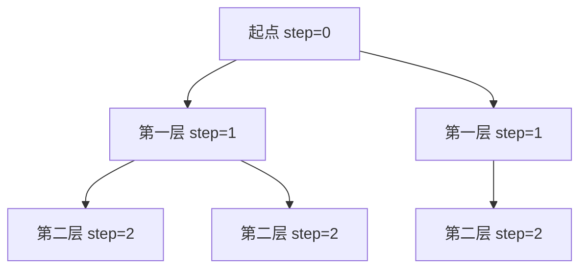

## 概述

**广度优先搜索（Breadth-First Search, BFS）** 是一种按层扩展的遍历算法。它从起点出发，先访问距离为 1 的节点，再访问距离为 2 的节点，因此天然适合求无权图中的最短步数。

> 前置知识
> - **队列**：先进先出，保证按层处理
> - **图 / 网格建模**：把状态看成节点，把一步转移看成边
> - **visited 集合**：避免重复入队和死循环

---

## 问题定义

给定起点和状态转移规则，按距离从近到远搜索目标状态。

| 要素 | 说明 |
|------|------|
| 输入 | 起点、目标、邻居生成函数或图结构 |
| 输出 | 到达目标的最少步数、层序结果或连通区域数量 |
| 核心结构 | 队列 + visited 集合 |
| 适用前提 | 每条边权重相同，或只关心最少转移次数 |

---

## 核心原理：分步图解

BFS 的扩展顺序像水波纹一样一层层向外扩散：



### 层序扩展

1. 起点入队，并标记为已访问。
2. 每轮只处理当前队列中的节点，这些节点属于同一层。
3. 将未访问的邻居加入队列，作为下一层。
4. 处理完一层后，步数 `step + 1`。

只要第一次遇到目标，就可以返回当前步数，因为 BFS 保证这是最短路径。

---

## 算法精细步骤

```
算法：BFS(start, target)
输入：起点 start，目标 target
输出：最少步数；不可达时返回 -1

1. queue ← [start]
2. visited ← {start}
3. step ← 0
4. while queue 不为空：
5.     size ← queue.length
6.     重复 size 次：
7.         cur ← queue 出队
8.         如果 cur 是 target，返回 step
9.         遍历 cur 的邻居 next：
10.            如果 next 未访问：标记并入队
11.    step ← step + 1
12. return -1
```

**复杂度分析**：

| 场景 | 时间复杂度 | 空间复杂度 | 说明 |
|------|------|------|------|
| 图遍历 | O(V + E) | O(V) | 每个点和边最多处理一次 |
| 网格 BFS | O(mn) | O(mn) | 每个格子最多入队一次 |
| 状态搜索 | O(状态数 × 分支数) | O(状态数) | 如转盘锁、单词接龙 |
| 双向 BFS | 约 O(b^(d/2)) | O(b^(d/2)) | 适合起点和终点都明确的搜索 |

---

## TypeScript 实现

### 1. 通用 BFS 模板

```typescript
function bfs<T>(start: T, isTarget: (node: T) => boolean, getNeighbors: (node: T) => T[]): number {
  const queue: T[] = [start];
  const visited = new Set<T>([start]);
  let head = 0;
  let step = 0;

  while (head < queue.length) {
    const size = queue.length - head;

    for (let i = 0; i < size; i++) {
      const cur = queue[head++];
      if (isTarget(cur)) return step;

      for (const next of getNeighbors(cur)) {
        if (visited.has(next)) continue;
        visited.add(next);
        queue.push(next);
      }
    }

    step++;
  }

  return -1;
}
```

### 2. 岛屿数量

```typescript
function numIslands(grid: string[][]): number {
  const m = grid.length;
  const n = grid[0].length;
  const dirs = [[1, 0], [-1, 0], [0, 1], [0, -1]];
  let count = 0;

  function floodFill(row: number, col: number): void {
    const queue: [number, number][] = [[row, col]];
    let head = 0;
    grid[row][col] = '0';

    while (head < queue.length) {
      const [x, y] = queue[head++];
      for (const [dx, dy] of dirs) {
        const nx = x + dx;
        const ny = y + dy;
        if (nx < 0 || nx >= m || ny < 0 || ny >= n || grid[nx][ny] !== '1') continue;
        grid[nx][ny] = '0';
        queue.push([nx, ny]);
      }
    }
  }

  for (let i = 0; i < m; i++) {
    for (let j = 0; j < n; j++) {
      if (grid[i][j] === '1') {
        count++;
        floodFill(i, j);
      }
    }
  }

  return count;
}
```

### 3. 打开转盘锁

```typescript
function openLock(deadends: string[], target: string): number {
  const dead = new Set(deadends);
  if (dead.has('0000')) return -1;

  const queue = ['0000'];
  const visited = new Set<string>(['0000']);
  let head = 0;
  let step = 0;

  function nextStates(state: string): string[] {
    const result: string[] = [];
    for (let i = 0; i < 4; i++) {
      const digit = Number(state[i]);
      for (const next of [(digit + 1) % 10, (digit + 9) % 10]) {
        result.push(state.slice(0, i) + next + state.slice(i + 1));
      }
    }
    return result;
  }

  while (head < queue.length) {
    const size = queue.length - head;

    for (let i = 0; i < size; i++) {
      const cur = queue[head++];
      if (cur === target) return step;

      for (const next of nextStates(cur)) {
        if (dead.has(next) || visited.has(next)) continue;
        visited.add(next);
        queue.push(next);
      }
    }

    step++;
  }

  return -1;
}
```

### 4. 双向 BFS

```typescript
function openLockBidirectional(deadends: string[], target: string): number {
  const dead = new Set(deadends);
  if (dead.has('0000')) return -1;

  let begin = new Set<string>(['0000']);
  let end = new Set<string>([target]);
  const visited = new Set<string>(['0000']);
  let step = 0;

  function nextStates(state: string): string[] {
    const result: string[] = [];
    for (let i = 0; i < 4; i++) {
      const digit = Number(state[i]);
      result.push(state.slice(0, i) + ((digit + 1) % 10) + state.slice(i + 1));
      result.push(state.slice(0, i) + ((digit + 9) % 10) + state.slice(i + 1));
    }
    return result;
  }

  while (begin.size > 0 && end.size > 0) {
    if (begin.size > end.size) [begin, end] = [end, begin];

    const nextLayer = new Set<string>();
    for (const cur of begin) {
      if (dead.has(cur)) continue;
      if (end.has(cur)) return step;

      for (const next of nextStates(cur)) {
        if (visited.has(next)) continue;
        visited.add(next);
        nextLayer.add(next);
      }
    }

    begin = nextLayer;
    step++;
  }

  return -1;
}
```

---

## 工程优化：队列与访问时机

JavaScript 数组的 `shift()` 会移动后续元素，大队列场景应使用 `head` 指针模拟出队。

| 优化点 | 推荐做法 | 原因 |
|------|------|------|
| 出队 | `const cur = queue[head++]` | 避免 `shift()` 的 O(n) 移动 |
| 标记访问 | 入队时标记 | 防止同一节点被重复加入队列 |
| 分层计数 | 记录当前层 `size` | 准确维护最短步数 |
| 双向搜索 | 从较小 frontier 扩展 | 降低指数级状态空间 |

---

## 应用与局限

### 典型应用

- 无权图最短路径
- 二叉树层序遍历
- 网格扩散：岛屿、迷宫、腐烂橘子
- 状态搜索：转盘锁、单词接龙

### 局限性

| 局限 | 说明 |
|------|------|
| 内存占用高 | 队列可能保存整层节点 |
| 不适合带权最短路 | 边权不同应使用 Dijkstra 等算法 |
| 状态爆炸 | 分支因子大时需要剪枝或双向搜索 |

---

## 总结


**核心要点**：

1. BFS = 队列 + visited + 按层扩展。
2. 无权图第一次到达目标就是最短路径。
3. 大队列使用 head 指针，不要频繁 `shift()`。
4. 起点和终点都明确时，优先考虑双向 BFS。
