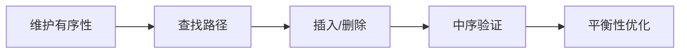

## 概述

二叉搜索树（Binary Search Tree，BST）是在二叉树基础上增加排序约束的数据结构。它让查找、插入、删除可以沿着树高方向进行，而不是扫描所有节点。

BST 的核心性质是：

```text
左子树所有值 < 当前节点值 < 右子树所有值
```

如果树保持平衡，操作复杂度接近 O(log n)；如果退化成链表，复杂度会变成 O(n)。

> 前置知识
> - **二叉树**：每个节点最多有左右两个子节点
> - **有序性**：左子树小于根，右子树大于根
> - **递归遍历**：查找、插入和验证都依赖子树递归

---

## 问题定义

BST 适合维护一组可比较的数据，并支持动态查找和更新。

示例：

```text
      8
     / \
    3   10
   / \    \
  1   6    14
```

查找 `6` 的路径：

```text
6 < 8  -> 去左边
6 > 3  -> 去右边
6 = 6  -> 找到
```

BST 问题通常围绕四件事：

| 操作 | 核心判断 |
| --- | --- |
| 查找 | 目标值与当前节点值比较 |
| 插入 | 找到合适的空位置 |
| 删除 | 删除后仍要保持 BST 性质 |
| 验证 | 每个节点必须落在合法范围内 |

---

## 核心原理：分步图解

### 查找路径

每次比较都会排除一半方向的子树：

```text
       8
      / \
   < 8   > 8
```

这就是 BST 比普通二叉树更适合查找的原因。

### 中序遍历

BST 的中序遍历结果一定是升序：

```text
左 -> 根 -> 右
1, 3, 6, 8, 10, 14
```

这个性质常用于验证 BST、找第 K 小元素、把 BST 转成有序数组。

### 删除节点

删除最复杂，因为要保持结构合法：

| 情况 | 处理方式 |
| --- | --- |
| 叶子节点 | 直接删除 |
| 只有一个子节点 | 用子节点替代当前节点 |
| 有两个子节点 | 用右子树最小节点或左子树最大节点替代 |

有两个子节点时，通常找“中序后继”：右子树中最小的节点。

---

## 算法精细步骤

插入一个值 `x`：

1. 如果当前节点为空，创建新节点；
2. 如果 `x < node.value`，插入左子树；
3. 如果 `x > node.value`，插入右子树；
4. 如果等于当前值，根据业务决定忽略、计数或放到某一侧；
5. 返回当前节点，保持父节点连接。

验证 BST 时，不能只比较当前节点和左右孩子。必须维护一个合法范围：

```text
min < node.value < max
```

进入左子树时，上界变成当前值；进入右子树时，下界变成当前值。

---

## TypeScript 实现

```typescript
class TreeNode {
  constructor(
    public value: number,
    public left: TreeNode | null = null,
    public right: TreeNode | null = null,
  ) {}
}
```

### 1. 查找

```typescript
function searchBST(root: TreeNode | null, target: number): TreeNode | null {
  let current = root;

  while (current !== null) {
    if (target === current.value) return current;
    current = target < current.value ? current.left : current.right;
  }

  return null;
}
```

### 2. 插入

```typescript
function insertIntoBST(root: TreeNode | null, value: number): TreeNode {
  if (root === null) return new TreeNode(value);

  if (value < root.value) {
    root.left = insertIntoBST(root.left, value);
  } else if (value > root.value) {
    root.right = insertIntoBST(root.right, value);
  }

  return root;
}
```

### 3. 验证

```typescript
function isValidBST(root: TreeNode | null): boolean {
  function validate(node: TreeNode | null, min: number, max: number): boolean {
    if (node === null) return true;
    if (node.value <= min || node.value >= max) return false;

    return validate(node.left, min, node.value) && validate(node.right, node.value, max);
  }

  return validate(root, Number.NEGATIVE_INFINITY, Number.POSITIVE_INFINITY);
}
```

---

## 工程优化：平衡性决定性能

BST 的理想形态接近平衡：

```text
      4
    /   \
   2     6
  / \   / \
 1   3 5   7
```

此时高度是 O(log n)。但如果按升序插入：

```text
1 -> 2 -> 3 -> 4 -> 5
```

树会退化成链表，查找变成 O(n)。

工程中如果需要稳定的有序集合能力，通常使用平衡树、跳表、B 树或数据库索引，而不是裸 BST。

---

## 应用与局限

### 典型应用

- 有序集合和有序映射；
- 查找第 K 小元素；
- 区间查询；
- 数据库和文件系统索引的基础思想；
- 把有序数组构造成平衡树。

### 局限性

- 不平衡时性能会退化；
- 删除逻辑比查找和插入复杂；
- 重复值策略需要提前定义；
- JavaScript 标准库没有内置平衡树结构。

---

## 总结



- BST 在二叉树上增加了左小右大的排序约束。
- 中序遍历 BST 会得到升序序列。
- 查找、插入、删除的复杂度取决于树高。
- 验证 BST 必须使用上下界，而不是只看直接子节点。
- 工程中要关注平衡性，否则 BST 会退化成链表。
