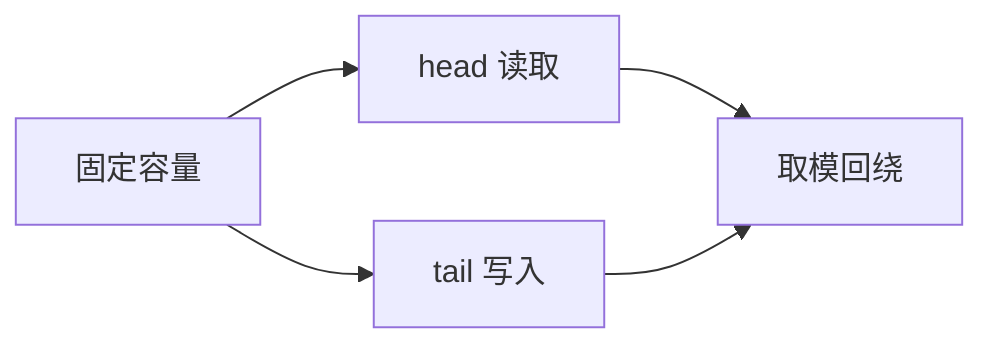

## 概述

环形数组不是一种新的物理存储结构，而是一种“把普通数组首尾相接”的使用方式。它通过取模运算让下标在数组边界处回到开头，从而模拟一个环。

这种结构特别适合固定容量、持续读写的场景，例如循环队列、日志缓冲区、音视频帧缓存和最近 N 条记录。

普通数组的尾部到达容量上限后就停止，而环形数组会把下一次写入映射回前面已经释放的位置。

> 前置知识
> - **取模运算**：下标通过 `% capacity` 回绕
> - **队列语义**：头尾指针分别负责读写
> - **容量设计**：需要区分空、满两种状态

---

## 问题定义

假设我们有一个固定长度为 5 的数组：

```text
index: 0 1 2 3 4
value: _ _ _ _ _
```

希望它支持：

- 从尾部写入新元素；
- 从头部读取旧元素；
- 空间用完时不要移动元素；
- 下标越过尾部时自动回到 0。

这就是环形数组要解决的问题：用固定数组实现逻辑上的循环空间。

---

## 核心原理：分步图解

环形数组通常维护三个状态：

```text
capacity: 固定容量
head:     下一个读取位置
tail:     下一个写入位置
size:     当前元素数量
```

### 写入元素

写入时把元素放到 `tail`，然后移动尾指针：

```text
tail = (tail + 1) % capacity
```

当 `tail` 到达数组末尾后，下一步会回到 0：

```text
index: 0 1 2 3 4
value: C D _ A B
head:        ^
tail:     ^
```

这张图表示逻辑顺序是 `A -> B -> C -> D`，但物理存储被分成了两段。

### 读取元素

读取时从 `head` 取出元素，然后移动头指针：

```text
head = (head + 1) % capacity
```

只要所有指针移动都使用同一个取模规则，数组就能稳定地循环使用。

---

## 算法精细步骤

实现环形队列时，重点是区分“空”和“满”。常见做法有两种：

| 方案 | 判断空 | 判断满 | 特点 |
| --- | --- | --- | --- |
| 额外维护 `size` | `size === 0` | `size === capacity` | 语义直观 |
| 预留一个空位 | `head === tail` | `(tail + 1) % capacity === head` | 少维护一个字段，但浪费一个位置 |

本文采用 `size` 方案，因为它更适合教学和 TypeScript 封装。

入队步骤：

1. 如果队列已满，拒绝写入；
2. 将元素写入 `items[tail]`；
3. `tail` 向后移动一格并取模；
4. `size` 加一。

出队步骤：

1. 如果队列为空，返回 `undefined`；
2. 读取 `items[head]`；
3. 清理当前位置；
4. `head` 向后移动一格并取模；
5. `size` 减一。

---

## TypeScript 实现

```typescript
class CircularQueue<T> {
  private readonly items: Array<T | undefined>;
  private head = 0;
  private tail = 0;
  private count = 0;

  constructor(private readonly capacity: number) {
    if (capacity <= 0) {
      throw new Error('capacity must be positive');
    }

    this.items = new Array<T | undefined>(capacity);
  }

  get size(): number {
    return this.count;
  }

  isEmpty(): boolean {
    return this.count === 0;
  }

  isFull(): boolean {
    return this.count === this.capacity;
  }

  enqueue(value: T): boolean {
    if (this.isFull()) return false;

    this.items[this.tail] = value;
    this.tail = (this.tail + 1) % this.capacity;
    this.count++;
    return true;
  }

  dequeue(): T | undefined {
    if (this.isEmpty()) return undefined;

    const value = this.items[this.head];
    this.items[this.head] = undefined;
    this.head = (this.head + 1) % this.capacity;
    this.count--;
    return value;
  }

  peek(): T | undefined {
    return this.items[this.head];
  }
}

const queue = new CircularQueue<number>(3);
queue.enqueue(1);
queue.enqueue(2);
queue.enqueue(3);
console.log(queue.enqueue(4)); // false
console.log(queue.dequeue()); // 1
queue.enqueue(4);
```

这个实现中，数组容量始终不变，所有位置都可以被重复利用。

---

## 工程优化：环形缓冲区

在日志或监控场景中，有时不希望队列满了以后拒绝写入，而是覆盖最旧的数据。这就是环形缓冲区。

```typescript
class RingBuffer<T> {
  private readonly items: Array<T | undefined>;
  private next = 0;
  private count = 0;

  constructor(private readonly capacity: number) {
    this.items = new Array<T | undefined>(capacity);
  }

  push(value: T): void {
    this.items[this.next] = value;
    this.next = (this.next + 1) % this.capacity;
    this.count = Math.min(this.count + 1, this.capacity);
  }

  values(): T[] {
    const result: T[] = [];
    const start = this.count === this.capacity ? this.next : 0;

    for (let i = 0; i < this.count; i++) {
      const index = (start + i) % this.capacity;
      result.push(this.items[index] as T);
    }

    return result;
  }
}
```

队列强调“不丢数据”，缓冲区强调“保留最新数据”。两者都使用环形数组，但业务语义不同。

---

## 应用与局限

### 典型应用

- 固定容量任务队列；
- 最近 N 条日志；
- 音视频流缓冲；
- 滑动窗口统计；
- 游戏或嵌入式系统中的事件队列。

### 局限性

- 容量固定，不适合无上限增长的数据；
- 需要明确满时策略：拒绝、等待、扩容还是覆盖；
- 取模运算让下标调试比普通数组更绕；
- 多线程环境下需要额外同步，单纯数组逻辑不保证并发安全。

---

## 总结



- 环形数组用取模把普通数组变成逻辑闭环。
- `head`、`tail`、`size` 是实现循环队列的核心状态。
- 队列和缓冲区的差异在于满时策略。
- 它适合固定容量、高频读写、避免元素搬移的场景。
