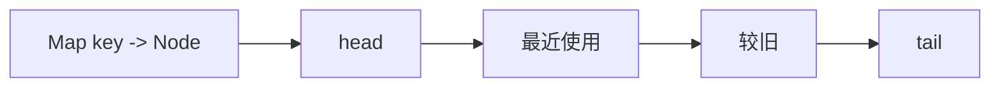
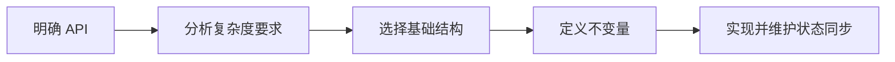

## 概述

**数据结构设计题** 要求在指定操作和复杂度约束下，组合已有数据结构实现新的抽象。重点不是写一个函数，而是维护对象内部状态，让每个方法都满足时间和空间要求。

> 前置知识
> - **栈、哈希表、链表**：高频设计题的基础组件
> - **复杂度约束**：每个 API 都要单独分析
> - **不变量**：对象内部状态必须在每次操作后保持一致

---

## 问题定义

给定一组 API 和复杂度要求，设计类的内部数据结构，使所有操作都能正确、高效地执行。

| 要素 | 说明 |
|------|------|
| 输入 | 构造参数和一组方法调用 |
| 输出 | 每个方法的返回值和对象状态变化 |
| 核心约束 | `get`、`put`、`push`、`pop` 等操作复杂度 |
| 典型问题 | 最小栈、哈希集合、LRU 缓存、LFU 缓存 |

---

## 核心原理：分步图解

以 LRU 缓存为例，哈希表负责 O(1) 定位节点，双向链表负责 O(1) 移动和淘汰：



每次 `get` 或更新已有 key，都把节点移动到链表头部；容量超限时，从尾部删除最久未使用节点。

---

## 算法精细步骤

```
算法：LRUCache.put(key, value)
输入：键和值
输出：无

1. 如果 key 已存在：
2.     更新节点值
3.     将节点移动到链表头部
4.     返回
5. 创建新节点并加入 Map
6. 将新节点插入链表头部
7. 如果容量超限：
8.     删除链表尾部节点
9.     从 Map 中删除对应 key
```

**复杂度分析**：

| 结构 | 操作 | 时间复杂度 | 空间复杂度 |
|------|------|------|------|
| 最小栈 | `push/pop/top/getMin` | O(1) | O(n) |
| 哈希集合 | `add/remove/contains` | 平均 O(1) | O(n) |
| LRU 缓存 | `get/put` | O(1) | O(capacity) |
| LFU 缓存 | `get/put` | O(1) 均摊 | O(capacity) |

---

## TypeScript 实现

### 1. 最小栈

```typescript
class MinStack {
  private stack: number[] = [];
  private minStack: number[] = [];

  push(value: number): void {
    this.stack.push(value);
    const min = this.minStack.length === 0
      ? value
      : Math.min(value, this.minStack[this.minStack.length - 1]);
    this.minStack.push(min);
  }

  pop(): void {
    this.stack.pop();
    this.minStack.pop();
  }

  top(): number {
    return this.stack[this.stack.length - 1];
  }

  getMin(): number {
    return this.minStack[this.minStack.length - 1];
  }
}
```

### 2. 哈希集合

```typescript
class MyHashSet {
  private readonly size = 769;
  private buckets: number[][] = Array.from({ length: 769 }, () => []);

  private hash(key: number): number {
    return key % this.size;
  }

  add(key: number): void {
    const bucket = this.buckets[this.hash(key)];
    if (!bucket.includes(key)) bucket.push(key);
  }

  remove(key: number): void {
    const bucket = this.buckets[this.hash(key)];
    const index = bucket.indexOf(key);
    if (index !== -1) bucket.splice(index, 1);
  }

  contains(key: number): boolean {
    return this.buckets[this.hash(key)].includes(key);
  }
}
```

### 3. LRU 节点

```typescript
class DLinkedNode {
  key: number;
  value: number;
  prev: DLinkedNode | null = null;
  next: DLinkedNode | null = null;

  constructor(key: number, value: number) {
    this.key = key;
    this.value = value;
  }
}
```

### 4. LRU 缓存

```typescript
class LRUCache {
  private cache = new Map<number, DLinkedNode>();
  private head = new DLinkedNode(0, 0);
  private tail = new DLinkedNode(0, 0);

  constructor(private capacity: number) {
    this.head.next = this.tail;
    this.tail.prev = this.head;
  }

  get(key: number): number {
    const node = this.cache.get(key);
    if (!node) return -1;

    this.moveToHead(node);
    return node.value;
  }

  put(key: number, value: number): void {
    const existing = this.cache.get(key);
    if (existing) {
      existing.value = value;
      this.moveToHead(existing);
      return;
    }

    const node = new DLinkedNode(key, value);
    this.cache.set(key, node);
    this.addToHead(node);

    if (this.cache.size > this.capacity) {
      const removed = this.removeTail();
      this.cache.delete(removed.key);
    }
  }

  private addToHead(node: DLinkedNode): void {
    node.prev = this.head;
    node.next = this.head.next;
    this.head.next!.prev = node;
    this.head.next = node;
  }

  private removeNode(node: DLinkedNode): void {
    node.prev!.next = node.next;
    node.next!.prev = node.prev;
  }

  private moveToHead(node: DLinkedNode): void {
    this.removeNode(node);
    this.addToHead(node);
  }

  private removeTail(): DLinkedNode {
    const node = this.tail.prev!;
    this.removeNode(node);
    return node;
  }
}
```

### 5. LFU 缓存简化实现

```typescript
interface LFUNode {
  key: number;
  value: number;
  freq: number;
}

class LFUCache {
  private minFreq = 0;
  private keyToNode = new Map<number, LFUNode>();
  private freqToKeys = new Map<number, Set<number>>();

  constructor(private capacity: number) {}

  get(key: number): number {
    const node = this.keyToNode.get(key);
    if (!node) return -1;

    this.increaseFreq(key);
    return node.value;
  }

  put(key: number, value: number): void {
    if (this.capacity === 0) return;

    const node = this.keyToNode.get(key);
    if (node) {
      node.value = value;
      this.increaseFreq(key);
      return;
    }

    if (this.keyToNode.size >= this.capacity) {
      const evictKey = this.freqToKeys.get(this.minFreq)!.values().next().value;
      this.freqToKeys.get(this.minFreq)!.delete(evictKey);
      this.keyToNode.delete(evictKey);
    }

    this.keyToNode.set(key, { key, value, freq: 1 });
    if (!this.freqToKeys.has(1)) this.freqToKeys.set(1, new Set());
    this.freqToKeys.get(1)!.add(key);
    this.minFreq = 1;
  }

  private increaseFreq(key: number): void {
    const node = this.keyToNode.get(key)!;
    const oldKeys = this.freqToKeys.get(node.freq)!;
    oldKeys.delete(key);

    if (oldKeys.size === 0 && node.freq === this.minFreq) {
      this.minFreq++;
    }

    node.freq++;
    if (!this.freqToKeys.has(node.freq)) this.freqToKeys.set(node.freq, new Set());
    this.freqToKeys.get(node.freq)!.add(key);
  }
}
```

---

## 工程优化：用不变量管理状态

| 设计题 | 核心不变量 | 辅助结构 |
|------|------|------|
| 最小栈 | `minStack[i]` 存储前 i 层最小值 | 辅助栈 |
| 哈希集合 | 同一 bucket 中不重复存 key | 桶数组 |
| LRU | 链表头部最新，尾部最旧 | Map + 双向链表 |
| LFU | `minFreq` 始终指向最小访问频率 | keyMap + freqMap |

写设计题时，先列 API，再列每个 API 后必须保持的不变量，比直接写代码更稳。

---

## 应用与局限

### 典型应用

- 缓存淘汰策略：LRU、LFU
- 栈/队列增强结构：最小栈、单调队列
- 哈希结构：集合、映射、计数器
- 业务对象状态机和资源池管理

### 局限性

| 局限 | 说明 |
|------|------|
| 状态耦合高 | 多个结构必须同步更新 |
| 边界多 | 空容量、重复 key、删除尾节点都要保持一致 |
| 实现复杂度高 | O(1) 要求通常需要组合多个结构 |

---

## 总结



**核心要点**：

1. 设计题的核心是用已有数据结构组合出新的操作语义。
2. 每个方法都要单独满足复杂度要求。
3. Map 负责快速定位，链表负责快速调整顺序，是缓存题的常见组合。
4. 内部不变量比代码模板更重要。
