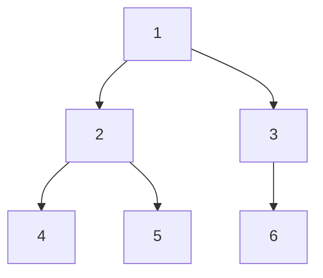

## 概述

**深度优先搜索（Depth-First Search, DFS）** 是一种沿着一条路径尽可能深入，再回退到分叉点继续搜索的遍历方法。它可以用递归隐式维护调用栈，也可以用显式栈迭代实现。

> 前置知识
> - **栈**：DFS 的路径状态后进先出
> - **递归**：天然表达树、图、网格中的深度探索
> - **visited 标记**：图和网格中用于避免重复访问

---

## 问题定义

给定树、图或网格结构，从起点出发探索所有可达状态，并在访问过程中计算结果或判断目标是否存在。

| 要素 | 说明 |
|------|------|
| 输入 | 起点、邻接关系、网格或树节点 |
| 输出 | 遍历顺序、连通区域、路径结果或布尔判断 |
| 核心状态 | 当前节点、路径、visited 集合、递归返回值 |
| 适用场景 | 连通性、路径枚举、树形递归、回溯搜索 |

---

## 核心原理：分步图解

DFS 会优先深入一个分支，直到不能继续，再回到上一个分叉点：



从节点 `1` 开始，前序 DFS 访问顺序可能是：

```text
1 → 2 → 4 → 回退 → 5 → 回退 → 3 → 6
```

### 递归视角

每一层递归只负责一个节点：处理当前节点、递归处理邻居、必要时返回子问题结果。

### 迭代视角

显式维护一个栈，每次弹出栈顶节点，将未访问邻居压栈。

---

## 算法精细步骤

```
算法：DFS(node)
输入：当前节点 node
输出：遍历或计算结果

1. 如果 node 为空或已访问，返回
2. 标记 node 为已访问
3. 处理当前节点
4. 遍历 node 的每个邻居 next：
5.     DFS(next)
6. 根据子结果合并并返回
```

**复杂度分析**：

| 场景 | 时间复杂度 | 空间复杂度 | 说明 |
|------|------|------|------|
| 树遍历 | O(n) | O(h) | h 为树高 |
| 图遍历 | O(V + E) | O(V) | visited 和递归栈 |
| 网格搜索 | O(mn) | O(mn) | 每个格子最多访问一次 |
| 回溯搜索 | 指数级 | O(depth) | 取决于分支因子和深度 |

---

## TypeScript 实现

### 1. 图 DFS 模板

```typescript
function dfsGraph(graph: Map<number, number[]>, start: number): number[] {
  const visited = new Set<number>();
  const result: number[] = [];

  function dfs(node: number): void {
    if (visited.has(node)) return;
    visited.add(node);
    result.push(node);

    for (const next of graph.get(node) ?? []) {
      dfs(next);
    }
  }

  dfs(start);
  return result;
}
```

### 2. 迭代 DFS

```typescript
function dfsIterative(graph: Map<number, number[]>, start: number): number[] {
  const stack = [start];
  const visited = new Set<number>([start]);
  const result: number[] = [];

  while (stack.length > 0) {
    const node = stack.pop()!;
    result.push(node);

    for (const next of graph.get(node) ?? []) {
      if (visited.has(next)) continue;
      visited.add(next);
      stack.push(next);
    }
  }

  return result;
}
```

### 3. 二叉树路径总和

```typescript
class TreeNode {
  val: number;
  left: TreeNode | null;
  right: TreeNode | null;

  constructor(val: number, left: TreeNode | null = null, right: TreeNode | null = null) {
    this.val = val;
    this.left = left;
    this.right = right;
  }
}

function hasPathSum(root: TreeNode | null, targetSum: number): boolean {
  if (root === null) return false;
  if (root.left === null && root.right === null) return root.val === targetSum;

  return (
    hasPathSum(root.left, targetSum - root.val) ||
    hasPathSum(root.right, targetSum - root.val)
  );
}
```

### 4. 岛屿最大面积

```typescript
function maxAreaOfIsland(grid: number[][]): number {
  const m = grid.length;
  const n = grid[0].length;
  const dirs = [[1, 0], [-1, 0], [0, 1], [0, -1]];

  function dfs(row: number, col: number): number {
    if (row < 0 || row >= m || col < 0 || col >= n || grid[row][col] !== 1) return 0;

    grid[row][col] = 0;
    let area = 1;
    for (const [dr, dc] of dirs) {
      area += dfs(row + dr, col + dc);
    }
    return area;
  }

  let maxArea = 0;
  for (let i = 0; i < m; i++) {
    for (let j = 0; j < n; j++) {
      if (grid[i][j] === 1) {
        maxArea = Math.max(maxArea, dfs(i, j));
      }
    }
  }

  return maxArea;
}
```

### 5. 路径枚举

```typescript
function pathSum(root: TreeNode | null, targetSum: number): number[][] {
  const result: number[][] = [];
  const path: number[] = [];

  function dfs(node: TreeNode | null, remaining: number): void {
    if (node === null) return;

    path.push(node.val);
    if (node.left === null && node.right === null && node.val === remaining) {
      result.push([...path]);
    }

    dfs(node.left, remaining - node.val);
    dfs(node.right, remaining - node.val);
    path.pop();
  }

  dfs(root, targetSum);
  return result;
}
```

---

## 工程优化：递归还是显式栈

| 写法 | 优点 | 代价 |
|------|------|------|
| 递归 DFS | 表达自然，代码短 | 深度过大可能栈溢出 |
| 迭代 DFS | 可控，不依赖调用栈 | 需要手动维护栈和状态 |
| 原地标记 | 节省 visited 空间 | 会修改输入数据 |
| visited 集合 | 不破坏输入 | 额外 O(n) 空间 |

在树结构中，递归通常最清晰；在图和大网格中，如果深度不可控，显式栈更稳妥。

---

## 应用与局限

### 典型应用

- 树的遍历、深度、高度、路径计算
- 图的连通性、环检测、拓扑相关判断
- 网格岛屿、迷宫、区域填充
- 回溯问题中的决策树搜索

### 局限性

| 局限 | 说明 |
|------|------|
| 不保证最短路径 | 无权最短路应优先 BFS |
| 递归深度风险 | 链式结构可能导致调用栈过深 |
| 状态易混乱 | 路径类问题要注意回退和复制 |

---

## 总结


**核心要点**：

1. DFS = 沿一条路径深入到底，再回退探索其他分支。
2. 树问题常用递归，图和网格问题必须处理 visited。
3. 路径枚举要在进入时加入路径，在离开时撤销。
4. 需要最短步数时，优先考虑 BFS 而不是 DFS。
