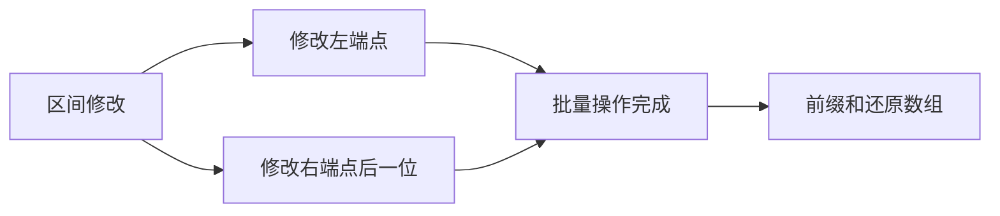

## 概述

**差分数组（Difference Array）** 是前缀和的逆运算。它把“对一个区间内所有元素加同一个值”的操作，转化为只修改区间两端，从而将单次区间修改从 O(n) 降到 O(1)。

> 前置知识
> - **前缀和**：差分数组最后通过前缀和还原原数组
> - **区间端点**：重点处理 `right + 1` 的边界
> - **离线处理**：适合先批量修改，最后统一查询结果

---

## 问题定义

给定初始数组和多次区间增减操作，求所有操作完成后的最终数组。

| 要素 | 说明 |
|------|------|
| 输入 | 初始数组、若干 `[left, right, delta]` 操作 |
| 输出 | 所有区间修改后的最终数组 |
| 更新公式 | `diff[left] += delta`，`diff[right + 1] -= delta` |
| 还原公式 | `nums[i] = nums[i - 1] + diff[i]` |

---

## 核心原理：分步图解

原数组 `[1, 2, 3, 4, 5]` 的差分数组为：

```text
nums:  1  2  3  4  5
diff:  1  1  1  1  1
```

对区间 `[1, 3]` 加 `2`：

```text
diff[1] += 2   从下标 1 开始整体抬高
diff[4] -= 2   从下标 4 开始取消影响

diff: 1  3  1  1 -1
前缀还原: 1  4  5  6  5
```



---

## 算法精细步骤

```
算法：DifferenceArray(nums, updates)
输入：原数组 nums，多次区间修改 updates
输出：最终数组

1. 构建 diff，其中 diff[0] = nums[0]
2. for i from 1 to n - 1:
3.     diff[i] = nums[i] - nums[i - 1]
4. 对每个操作 [left, right, delta]:
5.     diff[left] += delta
6.     if right + 1 < n: diff[right + 1] -= delta
7. 对 diff 做前缀和，还原最终数组
```

**复杂度分析**：

| 操作 | 暴力 | 差分 | 说明 |
|------|------|------|------|
| 单次区间修改 | O(n) | O(1) | 只改两个端点 |
| m 次区间修改 | O(nm) | O(m) | 修改阶段不遍历区间 |
| 最终还原 | O(1) | O(n) | 统一前缀和还原 |
| 总复杂度 | O(nm) | O(n + m) | 适合批量离线修改 |

---

## TypeScript 实现

### 1. 差分数组类

```typescript
class Difference {
  private diff: number[];

  constructor(nums: number[]) {
    this.diff = new Array(nums.length).fill(0);
    this.diff[0] = nums[0];

    for (let i = 1; i < nums.length; i++) {
      this.diff[i] = nums[i] - nums[i - 1];
    }
  }

  increment(left: number, right: number, value: number): void {
    this.diff[left] += value;
    if (right + 1 < this.diff.length) {
      this.diff[right + 1] -= value;
    }
  }

  result(): number[] {
    const nums = new Array(this.diff.length);
    nums[0] = this.diff[0];

    for (let i = 1; i < this.diff.length; i++) {
      nums[i] = nums[i - 1] + this.diff[i];
    }

    return nums;
  }
}
```

### 2. 航班预订统计

```typescript
function corpFlightBookings(bookings: number[][], n: number): number[] {
  const diff = new Array(n + 1).fill(0);

  for (const [first, last, seats] of bookings) {
    diff[first - 1] += seats;
    diff[last] -= seats;
  }

  const result: number[] = [];
  let current = 0;

  for (let i = 0; i < n; i++) {
    current += diff[i];
    result.push(current);
  }

  return result;
}
```

### 3. 拼车

```typescript
function carPooling(trips: number[][], capacity: number): boolean {
  const diff = new Array(1001).fill(0);

  for (const [passengers, from, to] of trips) {
    diff[from] += passengers;
    diff[to] -= passengers;
  }

  let current = 0;
  for (const change of diff) {
    current += change;
    if (current > capacity) return false;
  }

  return true;
}
```

### 4. 区间加法

```typescript
function getModifiedArray(length: number, updates: number[][]): number[] {
  const diff = new Array(length + 1).fill(0);

  for (const [start, end, inc] of updates) {
    diff[start] += inc;
    diff[end + 1] -= inc;
  }

  const result = new Array(length);
  let current = 0;
  for (let i = 0; i < length; i++) {
    current += diff[i];
    result[i] = current;
  }

  return result;
}
```

---

## 工程优化：离线修改与动态查询的取舍

差分数组适合“多次修改后一次性取结果”，不适合“边修改边查询”。

| 需求 | 推荐结构 | 原因 |
|------|------|------|
| 多次区间加，最后查询 | 差分数组 | 修改 O(1)，最终 O(n) 还原 |
| 区间加 + 单点查询 | 差分 / 树状数组 | 查询频率决定实现 |
| 区间加 + 区间查询 | 线段树 | 需要支持懒标记 |
| 二维矩阵区间加 | 二维差分 | 四个角记录变化 |

如果业务里每次修改后都要立即读取区间和，差分数组会失去优势，应换用支持在线查询的数据结构。

---

## 应用与局限

### 典型应用

- 批量区间加减
- 航班预订、会议室人数、拼车容量
- 时间轴事件统计
- 二维网格批量涂色或加权

### 局限性

| 局限 | 说明 |
|------|------|
| 查询滞后 | 通常要所有修改完成后统一还原 |
| 只适合可累加修改 | 对最大值、最小值等操作不直接适用 |
| 边界容易出错 | `right + 1` 是否存在必须判断清楚 |

---

## 总结


**核心要点**：

1. 差分数组是前缀和的逆运算。
2. 区间 `[left, right]` 加值，只需改 `left` 和 `right + 1`。
3. 适合“批量区间修改 + 最后一次查询”的离线场景。
4. 动态查询需求更强时，应考虑树状数组或线段树。
