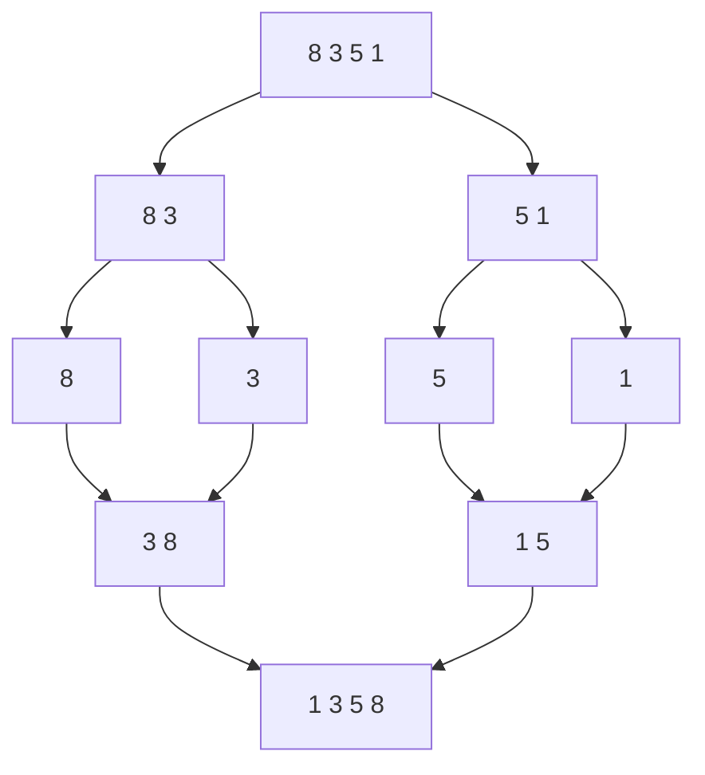

## 概述

**分治算法（Divide and Conquer）** 将一个大问题拆成若干个结构相同的小问题，分别求解后再合并结果。它常见于排序、查找、几何问题和递归优化。

> 前置知识
> - **递归**：分治通常通过递归表达问题拆分
> - **数组区间**：用左右边界表示当前子问题
> - **复杂度递推**：用“层数 × 每层成本”分析总复杂度

---

## 问题定义

当一个问题能拆成相互独立且形式相同的子问题时，可以使用分治。

| 要素 | 说明 |
|------|------|
| 输入 | 一个可切分的问题，如数组、区间、点集 |
| 输出 | 原问题的解，如排序结果、目标元素、最小距离 |
| 三个阶段 | 分解、求解、合并 |
| 典型算法 | 归并排序、快速排序、二分搜索、快速选择 |

---

## 核心原理：分步图解

归并排序是最典型的分治模型：



分治并不要求每一步都“合并”。快速排序通过分区让 pivot 就位，子数组排序完成后整体自然有序；二分搜索甚至只递归进入一侧。

---

## 算法精细步骤

```
算法：DivideAndConquer(problem)
输入：一个问题 problem
输出：problem 的解

1. 如果 problem 足够小，直接求解并返回
2. 将 problem 拆成若干子问题
3. 递归求解每个子问题
4. 将子问题结果合并成原问题结果
5. 返回合并结果
```

**复杂度分析**：

| 算法 | 分解方式 | 合并成本 | 时间复杂度 | 空间复杂度 |
|------|------|------|------|------|
| 归并排序 | 对半拆分 | O(n) | O(n log n) | O(n) |
| 快速排序 | pivot 分区 | O(1) | 平均 O(n log n) | O(log n) |
| 二分搜索 | 舍弃一半 | O(1) | O(log n) | O(1) |
| 快速选择 | 只递归一侧 | O(1) | 平均 O(n) | O(log n) |

---

## TypeScript 实现

### 1. 通用分治框架

```typescript
function divideAndConquer<T, R>(
  problem: T,
  isBaseCase: (problem: T) => boolean,
  solveBase: (problem: T) => R,
  split: (problem: T) => T[],
  merge: (results: R[]) => R,
): R {
  if (isBaseCase(problem)) return solveBase(problem);

  const subProblems = split(problem);
  const subResults = subProblems.map(sub =>
    divideAndConquer(sub, isBaseCase, solveBase, split, merge),
  );

  return merge(subResults);
}
```

### 2. 归并排序

```typescript
function mergeSort(nums: number[]): number[] {
  if (nums.length <= 1) return nums;

  const mid = Math.floor(nums.length / 2);
  const left = mergeSort(nums.slice(0, mid));
  const right = mergeSort(nums.slice(mid));

  return merge(left, right);
}

function merge(left: number[], right: number[]): number[] {
  const result: number[] = [];
  let i = 0;
  let j = 0;

  while (i < left.length && j < right.length) {
    if (left[i] <= right[j]) result.push(left[i++]);
    else result.push(right[j++]);
  }

  return result.concat(left.slice(i), right.slice(j));
}
```

### 3. 快速排序

```typescript
function quickSort(nums: number[], left = 0, right = nums.length - 1): void {
  if (left >= right) return;

  const pivotIndex = partition(nums, left, right);
  quickSort(nums, left, pivotIndex - 1);
  quickSort(nums, pivotIndex + 1, right);
}

function partition(nums: number[], left: number, right: number): number {
  const pivot = nums[right];
  let storeIndex = left;

  for (let i = left; i < right; i++) {
    if (nums[i] < pivot) {
      [nums[storeIndex], nums[i]] = [nums[i], nums[storeIndex]];
      storeIndex++;
    }
  }

  [nums[storeIndex], nums[right]] = [nums[right], nums[storeIndex]];
  return storeIndex;
}
```

### 4. 快速选择

```typescript
function findKthLargest(nums: number[], k: number): number {
  const target = nums.length - k;
  let left = 0;
  let right = nums.length - 1;

  while (left <= right) {
    const pivotIndex = partition(nums, left, right);
    if (pivotIndex === target) return nums[pivotIndex];
    if (pivotIndex < target) left = pivotIndex + 1;
    else right = pivotIndex - 1;
  }

  return nums[left];
}
```

### 5. 最近点对问题

```typescript
interface Point {
  x: number;
  y: number;
}

function closestPair(points: Point[]): number {
  points.sort((a, b) => a.x - b.x);

  function distance(a: Point, b: Point): number {
    return Math.hypot(a.x - b.x, a.y - b.y);
  }

  function solve(left: number, right: number): number {
    if (right - left <= 3) {
      let best = Infinity;
      for (let i = left; i <= right; i++) {
        for (let j = i + 1; j <= right; j++) {
          best = Math.min(best, distance(points[i], points[j]));
        }
      }
      return best;
    }

    const mid = (left + right) >> 1;
    const bestLeft = solve(left, mid);
    const bestRight = solve(mid + 1, right);
    let best = Math.min(bestLeft, bestRight);

    const strip: Point[] = [];
    for (let i = left; i <= right; i++) {
      if (Math.abs(points[i].x - points[mid].x) < best) strip.push(points[i]);
    }

    strip.sort((a, b) => a.y - b.y);
    for (let i = 0; i < strip.length; i++) {
      for (let j = i + 1; j < strip.length && strip[j].y - strip[i].y < best; j++) {
        best = Math.min(best, distance(strip[i], strip[j]));
      }
    }

    return best;
  }

  return solve(0, points.length - 1);
}
```

---

## 工程优化：控制递归深度与额外空间

| 场景 | 优化方向 | 说明 |
|------|------|------|
| 快速排序退化 | 随机 pivot / 三数取中 | 避免有序数组退化为 O(n²) |
| 归并排序空间 | 复用辅助数组 | 减少重复创建临时数组 |
| 递归过深 | 小区间转插入排序 / 迭代 | 降低调用栈风险 |
| 快速选择 | 只递归目标一侧 | 平均 O(n)，不需要完整排序 |

生产排序通常不会手写快速排序，更多是借分治思想解决“局部独立、合并可控”的问题。

---

## 应用与局限

### 典型应用

- 归并排序、快速排序、快速选择
- 二分搜索、答案二分
- 大规模数据分块处理
- 最近点对、逆序对统计

### 局限性

| 局限 | 说明 |
|------|------|
| 子问题需可合并 | 无法合并结果时分治不成立 |
| 递归开销 | 过深递归可能带来栈风险 |
| 不一定最省空间 | 归并类算法通常需要额外数组 |

---

## 总结


**核心要点**：

1. 分治 = 分解、求解、合并。
2. 归并排序强调合并，快速排序强调分区。
3. 每次规模减半通常带来 O(log n) 层递归。
4. 快速选择利用“只关心一侧”把平均复杂度降到 O(n)。
