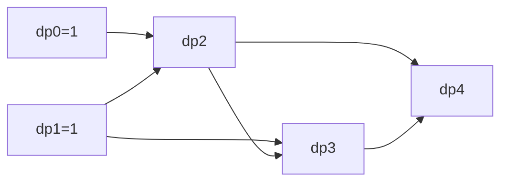

## 概述

**动态规划（Dynamic Programming, DP）** 通过保存子问题结果，避免重复计算。它适合具有最优子结构和重叠子问题的场景，比如路径计数、序列匹配、背包选择和区间最优值。

> 前置知识
> - **递归 / 记忆化搜索**：自顶向下理解状态依赖
> - **数组与矩阵**：一维、二维 DP 表是最常见的状态存储
> - **状态转移**：从已知小问题推导当前问题

---

## 问题定义

给定一个可拆分为重叠子问题的优化或计数问题，定义状态并通过转移方程求解最终答案。

| 要素 | 说明 |
|------|------|
| 输入 | 序列、容量、目标值或两个字符串 |
| 输出 | 最大/最小值、方案数、最长长度或最少操作数 |
| 核心状态 | `dp[i]`、`dp[i][j]` 或压缩后的一维数组 |
| 关键问题 | 状态含义、转移方程、初始化、遍历顺序 |

---

## 核心原理：分步图解

以爬楼梯为例，到第 `i` 阶只能从 `i - 1` 或 `i - 2` 转移而来：



状态转移为：

```text
dp[i] = dp[i - 1] + dp[i - 2]
```

动态规划的难点通常不在代码，而在把问题改写成“当前状态如何由更小状态得到”。

---

## 算法精细步骤

```
算法：SolveDP(problem)
输入：可拆分的问题
输出：最优值、方案数或可行性

1. 定义状态：dp[i] 或 dp[i][j] 表示什么
2. 写出转移方程：当前状态从哪些旧状态来
3. 初始化边界状态：空数组、第一行、第一列等
4. 确定遍历顺序：保证依赖状态已计算
5. 返回答案：dp[n]、dp[m][n] 或表中最大值
```

**复杂度分析**：

| 问题 | 状态定义 | 时间复杂度 | 空间复杂度 |
|------|------|------|------|
| 爬楼梯 | `dp[i]` 到第 i 阶方案数 | O(n) | O(1) |
| 打家劫舍 | `dp[i]` 前 i 间最大收益 | O(n) | O(1) |
| LCS | `dp[i][j]` 两个前缀最长公共子序列 | O(mn) | O(mn) |
| 编辑距离 | `dp[i][j]` 前缀转换最少操作 | O(mn) | O(mn) |
| 0-1 背包 | `dp[w]` 容量 w 最大价值 | O(nW) | O(W) |

---

## TypeScript 实现

### 1. 爬楼梯

```typescript
function climbStairs(n: number): number {
  if (n <= 2) return n;

  let prev2 = 1;
  let prev1 = 2;

  for (let i = 3; i <= n; i++) {
    const current = prev1 + prev2;
    prev2 = prev1;
    prev1 = current;
  }

  return prev1;
}
```

### 2. 打家劫舍

```typescript
function rob(nums: number[]): number {
  let prev2 = 0;
  let prev1 = 0;

  for (const money of nums) {
    const current = Math.max(prev1, prev2 + money);
    prev2 = prev1;
    prev1 = current;
  }

  return prev1;
}
```

### 3. 最长公共子序列

```typescript
function longestCommonSubsequence(text1: string, text2: string): number {
  const m = text1.length;
  const n = text2.length;
  const dp = Array.from({ length: m + 1 }, () => new Array(n + 1).fill(0));

  for (let i = 1; i <= m; i++) {
    for (let j = 1; j <= n; j++) {
      if (text1[i - 1] === text2[j - 1]) {
        dp[i][j] = dp[i - 1][j - 1] + 1;
      } else {
        dp[i][j] = Math.max(dp[i - 1][j], dp[i][j - 1]);
      }
    }
  }

  return dp[m][n];
}
```

### 4. 编辑距离

```typescript
function minDistance(word1: string, word2: string): number {
  const m = word1.length;
  const n = word2.length;
  const dp = Array.from({ length: m + 1 }, () => new Array(n + 1).fill(0));

  for (let i = 0; i <= m; i++) dp[i][0] = i;
  for (let j = 0; j <= n; j++) dp[0][j] = j;

  for (let i = 1; i <= m; i++) {
    for (let j = 1; j <= n; j++) {
      if (word1[i - 1] === word2[j - 1]) {
        dp[i][j] = dp[i - 1][j - 1];
      } else {
        dp[i][j] = 1 + Math.min(dp[i - 1][j], dp[i][j - 1], dp[i - 1][j - 1]);
      }
    }
  }

  return dp[m][n];
}
```

### 5. 0-1 背包

```typescript
function knapsack(weights: number[], values: number[], capacity: number): number {
  const dp = new Array(capacity + 1).fill(0);

  for (let i = 0; i < weights.length; i++) {
    for (let w = capacity; w >= weights[i]; w--) {
      dp[w] = Math.max(dp[w], dp[w - weights[i]] + values[i]);
    }
  }

  return dp[capacity];
}
```

### 6. 最长递增子序列

```typescript
function lengthOfLIS(nums: number[]): number {
  const tails: number[] = [];

  for (const num of nums) {
    let left = 0;
    let right = tails.length;

    while (left < right) {
      const mid = left + Math.floor((right - left) / 2);
      if (tails[mid] < num) left = mid + 1;
      else right = mid;
    }

    tails[left] = num;
  }

  return tails.length;
}
```

---

## 工程优化：状态压缩与遍历顺序

| 优化点 | 做法 | 注意事项 |
|------|------|------|
| 一维压缩 | 只保留上一行或必要状态 | 必须确认依赖方向 |
| 滚动变量 | 如爬楼梯只保留两个值 | 适合依赖固定数量旧状态 |
| 0-1 背包 | 容量倒序遍历 | 防止同一物品被重复使用 |
| 完全背包 | 容量正序遍历 | 允许同一物品重复使用 |
| 记忆化搜索 | 自顶向下缓存结果 | 更贴近递归定义，调试直观 |

DP 优化不能只看空间减少，还要保证状态依赖没有被提前覆盖。

---

## 应用与局限

### 典型应用

- 路径计数、爬楼梯、网格路径
- 序列问题：LCS、LIS、编辑距离
- 背包与资源分配
- 股票买卖、区间 DP、状态压缩 DP

### 局限性

| 局限 | 说明 |
|------|------|
| 状态设计困难 | 状态含义不清会导致转移错误 |
| 空间可能很大 | 二维或多维 DP 容易占用大量内存 |
| 不适合无重叠子问题 | 没有重复计算时 DP 收益有限 |

---

## 总结


**核心要点**：

1. DP 解决的是具有重叠子问题和最优子结构的问题。
2. 写 DP 前先说清楚 `dp` 数组每个位置的含义。
3. 遍历顺序必须保证依赖状态已经计算完成。
4. 状态压缩的核心是确认旧状态不会被错误覆盖。
