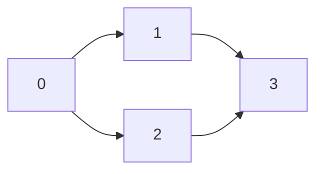
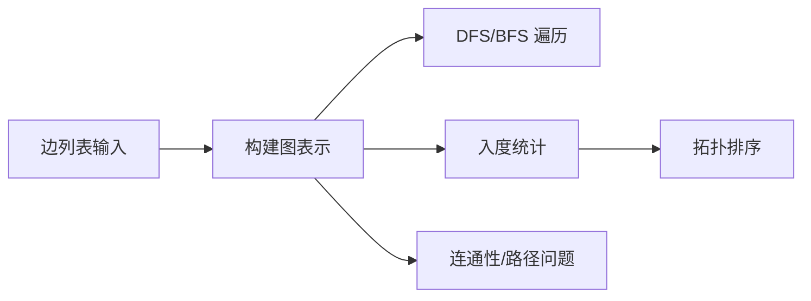

## 概述

**图（Graph）** 用顶点和边描述对象之间的关系。相比数组、链表、树，图更适合表达“多对多连接”，例如社交关系、依赖关系、地图道路和任务调度。

> 前置知识
> - **哈希表 / 数组**：常用于存储邻接表
> - **DFS / BFS**：图遍历的基础算法
> - **入度**：拓扑排序中用于判断节点是否可处理

---

## 问题定义

给定顶点集合和边集合，选择合适的表示方式并完成遍历、连通性判断或依赖排序。

| 要素 | 说明 |
|------|------|
| 输入 | 顶点数量、边列表、方向和权重 |
| 输出 | 邻接结构、遍历结果、拓扑序或连通分量数量 |
| 常见表示 | 邻接表、邻接矩阵、边列表 |
| 典型问题 | DFS/BFS、课程表、连通分量、最短路径 |

---

## 核心原理：分步图解

有向图边列表 `[[0,1], [0,2], [1,3], [2,3]]` 可以表示为邻接表：



对应结构：

```text
0 -> [1, 2]
1 -> [3]
2 -> [3]
3 -> []
```

### 拓扑排序直觉

如果一条边 `u -> v` 表示“先完成 u，才能完成 v”，那么每次取出入度为 `0` 的节点，就能得到一条合法的依赖执行顺序。

---

## 算法精细步骤

```
算法：TopologicalSort(n, edges)
输入：节点数 n，依赖边 edges
输出：拓扑序；有环时返回空数组

1. 构建邻接表 graph 和入度数组 indegree
2. 将所有 indegree 为 0 的节点入队
3. while 队列不为空：
4.     node 出队并加入结果
5.     遍历 node 的邻居 next：
6.         indegree[next] -= 1
7.         如果 indegree[next] == 0，入队
8. 如果结果长度为 n，返回结果；否则说明有环
```

**复杂度分析**：

| 操作 | 时间复杂度 | 空间复杂度 | 说明 |
|------|------|------|------|
| 构建邻接表 | O(V + E) | O(V + E) | 初始化节点并加入边 |
| DFS / BFS | O(V + E) | O(V) | 每个点和边最多访问一次 |
| 拓扑排序 | O(V + E) | O(V + E) | 邻接表和入度数组 |
| 邻接矩阵查询边 | O(1) | O(V²) | 适合稠密图 |

---

## TypeScript 实现

### 1. 邻接表构建

```typescript
type AdjList = Map<number, number[]>;

function buildGraph(n: number, edges: number[][], directed = true): AdjList {
  const graph: AdjList = new Map();

  for (let i = 0; i < n; i++) {
    graph.set(i, []);
  }

  for (const [from, to] of edges) {
    graph.get(from)!.push(to);
    if (!directed) graph.get(to)!.push(from);
  }

  return graph;
}
```

### 2. DFS 遍历

```typescript
function dfs(graph: AdjList, start: number): number[] {
  const visited = new Set<number>();
  const result: number[] = [];

  function visit(node: number): void {
    if (visited.has(node)) return;
    visited.add(node);
    result.push(node);

    for (const next of graph.get(node) ?? []) {
      visit(next);
    }
  }

  visit(start);
  return result;
}
```

### 3. BFS 遍历

```typescript
function bfs(graph: AdjList, start: number): number[] {
  const queue = [start];
  const visited = new Set<number>([start]);
  const result: number[] = [];
  let head = 0;

  while (head < queue.length) {
    const node = queue[head++];
    result.push(node);

    for (const next of graph.get(node) ?? []) {
      if (visited.has(next)) continue;
      visited.add(next);
      queue.push(next);
    }
  }

  return result;
}
```

### 4. 拓扑排序

```typescript
function topologicalSort(numCourses: number, prerequisites: number[][]): number[] {
  const graph = buildGraph(numCourses, prerequisites);
  const indegree = new Array(numCourses).fill(0);

  for (const [, to] of prerequisites) {
    indegree[to]++;
  }

  const queue: number[] = [];
  for (let i = 0; i < numCourses; i++) {
    if (indegree[i] === 0) queue.push(i);
  }

  const result: number[] = [];
  let head = 0;

  while (head < queue.length) {
    const node = queue[head++];
    result.push(node);

    for (const next of graph.get(node) ?? []) {
      indegree[next]--;
      if (indegree[next] === 0) queue.push(next);
    }
  }

  return result.length === numCourses ? result : [];
}
```

### 5. 连通分量数量

```typescript
function findCircleNum(isConnected: number[][]): number {
  const n = isConnected.length;
  const visited = new Set<number>();
  let provinces = 0;

  function dfsCity(city: number): void {
    visited.add(city);

    for (let next = 0; next < n; next++) {
      if (isConnected[city][next] === 1 && !visited.has(next)) {
        dfsCity(next);
      }
    }
  }

  for (let city = 0; city < n; city++) {
    if (!visited.has(city)) {
      provinces++;
      dfsCity(city);
    }
  }

  return provinces;
}
```

---

## 工程优化：邻接表还是邻接矩阵

| 表示方式 | 优点 | 代价 | 适用场景 |
|------|------|------|------|
| 邻接表 | 空间 O(V + E)，遍历邻居快 | 判断两点是否有边需遍历邻居 | 稀疏图、遍历类问题 |
| 邻接矩阵 | 判断边 O(1) | 空间 O(V²) | 稠密图、节点数较小 |
| 边列表 | 输入和排序方便 | 查邻居慢 | Kruskal、Bellman-Ford |

JavaScript/TypeScript 中，如果节点编号连续，`number[][]` 通常比 `Map<number, number[]>` 更轻；如果节点是字符串或稀疏 ID，`Map` 更自然。

---

## 应用与局限

### 典型应用

- 依赖分析：课程表、任务编排、包管理
- 社交网络、推荐系统、关系链搜索
- 地图路径、网络路由、最短路径
- 连通分量、环检测、拓扑排序

### 局限性

| 局限 | 说明 |
|------|------|
| 建模成本高 | 需要先明确节点和边的含义 |
| 大图内存压力 | 邻接结构可能非常大 |
| 算法选择依赖图类型 | 有向/无向、有权/无权、是否有环都会影响解法 |

---

## 总结



**核心要点**：

1. 图用于表达多对多关系，邻接表是最常用表示。
2. DFS 适合连通性和深度探索，BFS 适合层序和无权最短路。
3. 拓扑排序依赖入度为 0 的节点不断出队。
4. 先判断图的类型，再选择合适的数据结构和算法。
