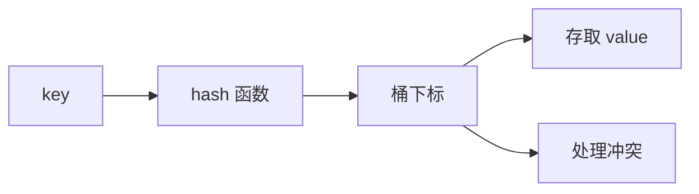

## 概述

哈希表是一种通过键快速定位值的数据结构。它把键经过哈希函数映射到数组位置，从而在平均情况下实现 O(1) 的查找、插入和删除。

在 JavaScript / TypeScript 中，常用的哈希结构是 `Map`、`Set` 和普通对象。它们广泛用于去重、计数、缓存、索引构建和两数之和这类算法问题。

哈希表的核心思想是：用空间换时间。

> 前置知识
> - **哈希函数**：把 key 映射到桶位置
> - **数组 / 桶**：底层通常用数组承载元素
> - **冲突处理**：不同 key 可能落到同一个桶

---

## 问题定义

如果我们要频繁回答“某个值是否出现过”或“某个键对应什么数据”，线性扫描会很慢。

例如在数组中查找：

```text
[12, 7, 9, 20, 31]
```

每次都可能扫完整个数组，复杂度是 O(n)。哈希表希望把这个问题变成：

```text
key -> hash -> bucket -> value
```

常见需求包括：

| 需求 | 推荐结构 |
| --- | --- |
| 判断元素是否存在 | `Set` |
| 统计出现次数 | `Map<T, number>` |
| 建立 ID 到对象的索引 | `Map<string, Item>` |
| 字符串键的简单记录 | `Record<string, T>` |

---

## 核心原理：分步图解

哈希表的逻辑流程可以拆成三步：

```text
key -> hash(key) -> index -> bucket
```

假设容量为 8，某个键的哈希值是 18：

```text
index = 18 % 8 = 2
```

于是它被放入下标 2 的桶中。

### 哈希冲突

不同键可能映射到同一个位置：

```text
hash("a") % 8 = 2
hash("b") % 8 = 2
```

这叫哈希冲突。常见解决方式有：

- 链地址法：每个桶里放一个链表或数组；
- 开放寻址：冲突后继续寻找下一个空位；
- 扩容再散列：负载因子过高时扩大容量。

在日常 TypeScript 开发中，我们不需要自己处理这些细节，但理解它能帮助判断哈希表的性能边界。

---

## 基本操作与复杂度

| 操作 | 平均复杂度 | 最坏复杂度 | 说明 |
| --- | --- | --- | --- |
| `set` | O(1) | O(n) | 冲突严重时退化 |
| `get` | O(1) | O(n) | 依赖哈希分布 |
| `has` | O(1) | O(n) | 集合判断常用 |
| `delete` | O(1) | O(n) | 删除键值关系 |
| 遍历 | O(n) | O(n) | 访问所有键值对 |

实际工程里，内置 `Map` / `Set` 已经处理了扩容和冲突，优先使用它们，而不是手写哈希表。

---

## TypeScript 实现

### 1. 计数器

```typescript
function countBy<T>(items: T[]): Map<T, number> {
  const counter = new Map<T, number>();

  for (const item of items) {
    counter.set(item, (counter.get(item) ?? 0) + 1);
  }

  return counter;
}

console.log(countBy(['a', 'b', 'a']));
```

### 2. 两数之和

```typescript
function twoSum(nums: number[], target: number): [number, number] | null {
  const seen = new Map<number, number>();

  for (let i = 0; i < nums.length; i++) {
    const need = target - nums[i];

    if (seen.has(need)) {
      return [seen.get(need)!, i];
    }

    seen.set(nums[i], i);
  }

  return null;
}
```

这个实现把“向前查找另一个数”的 O(n) 扫描变成了 O(1) 查询。

### 3. 分组

```typescript
function groupBy<T, K>(items: T[], getKey: (item: T) => K): Map<K, T[]> {
  const groups = new Map<K, T[]>();

  for (const item of items) {
    const key = getKey(item);
    const group = groups.get(key);

    if (group) {
      group.push(item);
    } else {
      groups.set(key, [item]);
    }
  }

  return groups;
}
```

哈希表很适合把列表重新组织成“键到集合”的索引。

---

## 工程优化：Map、Set 与 Object

| 结构 | 适用场景 | 注意点 |
| --- | --- | --- |
| `Map` | 任意类型键、频繁增删 | 语义最清晰 |
| `Set` | 去重、存在性判断 | 只关心值是否出现 |
| `Record<string, T>` | 固定字符串键对象 | 原型和键转换要注意 |
| `WeakMap` | 对象元数据、避免内存泄漏 | 键必须是对象，不能遍历 |

通常建议：

- 键不是固定字段时，用 `Map`；
- 只判断是否存在时，用 `Set`；
- 表示明确对象结构时，用普通对象或 `Record`。

---

## 应用与局限

### 典型应用

- 数组去重；
- 频次统计；
- 缓存和 memoization；
- 根据 ID 快速查找对象；
- 图的邻接表；
- 两数之和、最长连续序列、异位词分组。

### 局限性

- 哈希表不天然有序，虽然 JS `Map` 保留插入顺序，但不能当排序结构使用；
- 需要额外空间；
- 对象作为键时比较的是引用，不是内容；
- 键设计不稳定会导致缓存命中率低。

---

## 总结



- 哈希表通过键到位置的映射提升查找效率。
- `Map`、`Set` 是 TypeScript 中最常用的哈希结构。
- 哈希适合存在性判断、计数、索引和缓存。
- 它用额外空间换取平均 O(1) 的查询速度。
- 选择键时要确保语义稳定，尤其是对象键和缓存场景。
