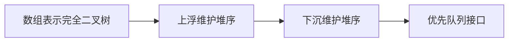

## 概述

堆是一种满足特定顺序约束的完全二叉树，通常用数组实现。它最擅长的问题是：动态维护一组数据中的最大值或最小值。

常见堆分为两类：

- 小顶堆：父节点小于等于子节点，堆顶是最小值；
- 大顶堆：父节点大于等于子节点，堆顶是最大值。

堆是 TopK、优先队列、任务调度、合并有序流和最短路径算法的重要基础。

> 前置知识
> - **完全二叉树**：堆的结构基础
> - **数组下标关系**：父子节点可由下标计算
> - **优先级队列**：堆最常见的工程接口

---

## 问题定义

如果我们需要反复取出当前最小或最大的元素，普通数组有两个明显问题：

| 方案 | 插入 | 取最值 | 问题 |
| --- | --- | --- | --- |
| 无序数组 | O(1) | O(n) | 每次都要扫描 |
| 有序数组 | O(n) | O(1) | 插入要移动元素 |
| 堆 | O(log n) | O(log n) | 插入和删除都稳定 |

堆牺牲了完整有序性，只保证堆顶是全局最值，因此能在动态场景下取得更好的平衡。

---

## 核心原理：分步图解

堆是一棵完全二叉树，可以紧凑地存进数组：

```text
        1
      /   \
     3     5
    / \   /
   7   9 8

数组: [1, 3, 5, 7, 9, 8]
```

数组下标关系：

```text
parent(i) = Math.floor((i - 1) / 2)
left(i)   = 2 * i + 1
right(i)  = 2 * i + 2
```

### 上浮

插入新元素时，先放到数组末尾，再不断和父节点比较。如果比父节点更小，就交换位置。

### 下沉

删除堆顶时，把末尾元素放到堆顶，然后不断和更小的子节点交换，直到恢复堆性质。

---

## 算法精细步骤

小顶堆插入：

1. 把元素追加到数组末尾；
2. 当前下标设为新元素位置；
3. 如果当前元素小于父节点，交换；
4. 继续向上比较，直到根节点或父节点更小。

小顶堆弹出：

1. 保存堆顶作为返回值；
2. 用末尾元素替换堆顶；
3. 从根节点开始，与左右孩子中更小者比较；
4. 如果当前节点更大，则交换并继续下沉；
5. 恢复堆性质后返回原堆顶。

---

## TypeScript 实现

```typescript
class MinHeap<T> {
  private readonly data: T[] = [];

  constructor(private readonly compare: (a: T, b: T) => number) {}

  get size(): number {
    return this.data.length;
  }

  peek(): T | undefined {
    return this.data[0];
  }

  push(value: T): void {
    this.data.push(value);
    this.bubbleUp(this.data.length - 1);
  }

  pop(): T | undefined {
    if (this.data.length === 0) return undefined;
    if (this.data.length === 1) return this.data.pop();

    const root = this.data[0];
    this.data[0] = this.data.pop()!;
    this.sinkDown(0);
    return root;
  }

  private bubbleUp(index: number): void {
    while (index > 0) {
      const parent = Math.floor((index - 1) / 2);
      if (this.compare(this.data[index], this.data[parent]) >= 0) break;

      [this.data[index], this.data[parent]] = [this.data[parent], this.data[index]];
      index = parent;
    }
  }

  private sinkDown(index: number): void {
    while (true) {
      const left = index * 2 + 1;
      const right = index * 2 + 2;
      let smallest = index;

      if (left < this.data.length && this.compare(this.data[left], this.data[smallest]) < 0) {
        smallest = left;
      }

      if (right < this.data.length && this.compare(this.data[right], this.data[smallest]) < 0) {
        smallest = right;
      }

      if (smallest === index) break;

      [this.data[index], this.data[smallest]] = [this.data[smallest], this.data[index]];
      index = smallest;
    }
  }
}
```

### TopK 示例

```typescript
function topK(nums: number[], k: number): number[] {
  const heap = new MinHeap<number>((a, b) => a - b);

  for (const num of nums) {
    heap.push(num);

    if (heap.size > k) {
      heap.pop();
    }
  }

  const result: number[] = [];
  while (heap.size > 0) {
    result.push(heap.pop()!);
  }

  return result;
}
```

这里用小顶堆保留最大的 k 个数，堆顶始终是当前 TopK 中最小的候选。

---

## 工程优化：优先队列接口

很多业务场景不直接关心“堆”，而关心“优先级最高的任务先执行”。这时可以把堆封装成优先队列：

```typescript
const queue = new MinHeap<{ priority: number; task: string }>(
  (a, b) => a.priority - b.priority,
);

queue.push({ priority: 10, task: 'low' });
queue.push({ priority: 1, task: 'high' });
console.log(queue.pop()?.task); // high
```

把比较函数作为构造参数，可以让同一个堆实现支持数字、对象和自定义优先级。

---

## 应用与局限

### 典型应用

- TopK 问题；
- 合并 K 个有序数组或链表；
- 数据流中位数；
- Dijkstra 最短路径；
- 任务调度和优先级队列。

### 局限性

- 堆只保证堆顶最优，不保证整体有序；
- 查找任意元素仍然是 O(n)；
- 删除非堆顶元素需要额外索引支持；
- JavaScript 标准库没有内置堆，需要自己实现或引入库。

---

## 总结



- 堆是用数组表示的完全二叉树。
- 小顶堆堆顶是最小值，大顶堆堆顶是最大值。
- 插入靠上浮，删除堆顶靠下沉。
- 堆适合动态维护最值，而不是完整排序。
- TopK 和优先队列是堆最常见的应用场景。
