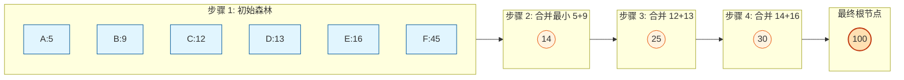
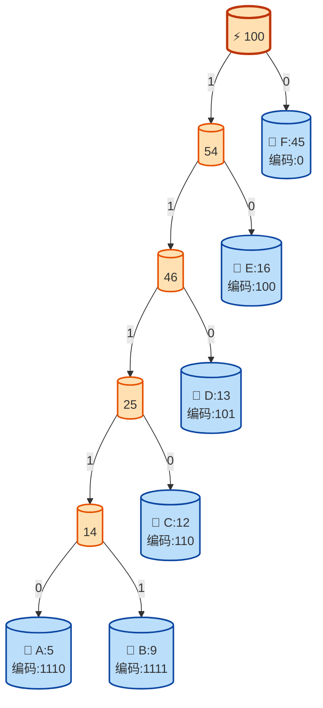

## 1. 什么是霍夫曼编码？

霍夫曼编码（Huffman Coding）是一种用于**无损数据压缩**的熵编码算法。由大卫·霍夫曼（David Huffman）于 1952 年提出。

它的核心思想是：​**让出现频率高的字符使用较短的编码，出现频率低的字符使用较长的编码**​，从而减少整体数据的存储空间。

### 1.1 为什么需要它？

在传统的 ASCII 编码中，每个字符都占用固定的 8 位（1 字节）。例如字符串 `"AABCCC"`：

| 字符           | ASCII 二进制 | 长度              |
| ---------------- | -------------- | ------------------- |
| A              | 01000001     | 8 bits            |
| A              | 01000001     | 8 bits            |
| B              | 01000010     | 8 bits            |
| C              | 01000011     | 8 bits            |
| C              | 01000011     | 8 bits            |
| C              | 01000011     | 8 bits            |
| **总计** |              | **48 bits** |

如果使用霍夫曼编码，根据频率分配变长编码，可能只需要 **14 bits** 左右，压缩率非常可观。

---

## 2. 核心原理：霍夫曼树

霍夫曼编码的载体是一棵​**二叉树**​，称为​**霍夫曼树**​（Huffman Tree）或最优二叉树。

### 2.1 构建规则

1. ​**统计频率**​：统计每个字符出现的权重（频率）。
2. ​**排序**​：将节点按权重从小到大排序。
3. ​**合并**​：取出权重最小的两个节点，合并为一个新节点，新节点的权重为两者之和。
4. ​**重复**​：将新节点放回集合，重复步骤 2-3，直到只剩下一个根节点。

### 2.2 构建过程可视化

假设我们有以下字符频率：`A:5, B:9, C:12, D:13, E:16, F:45`。


## 3. 生成编码：前缀码特性

霍夫曼树构建完成后，我们从根节点出发：

* 向**左**走记录为 `0`
* 向**右**走记录为 `1`
* （或者相反，只要统一即可）

### 3.1 最终树结构与编码表

最终生成的树结构如下，叶子节点即为原始字符：


### 3.2 编码结果对比

| 字符           | 频率          | 霍夫曼编码 | 编码长度 | 总比特数 (频率×长度) |
| ---------------- | --------------- | ------------ | ---------- | ----------------------- |
| **F**    | 45            | `0`    | 1        | 45                    |
| **E**    | 16            | `100`  | 3        | 48                    |
| **D**    | 13            | `101`  | 3        | 39                    |
| **C**    | 12            | `110`  | 3        | 36                    |
| **A**    | 5             | `1110` | 4        | 20                    |
| **B**    | 9             | `1111` | 4        | 36                    |
| **总计** | **100** | -          | -        | **224 bits**    |

> ​**对比**​：如果使用定长编码（至少 3 位才能表示 6 个字符），总比特数为 `100 × 3 = 300 bits`。霍夫曼编码节省了 **25%** 的空间。

### 3.3 关键特性：前缀码 (Prefix Code)

注意观察上面的编码表，​**没有任何一个编码是另一个编码的前缀**​。

* `F` 是 `0`
* `E` 是 `100`

这意味着解码时​**不会产生歧义**​。当我们读到 `0` 时，立刻知道是 `F`；读到 `1` 时，知道需要继续读下一位。这使得霍夫曼编码无需分隔符即可连续传输。

---

## 4. 带权路径长度 (WPL)

霍夫曼树是**带权路径长度最短**的二叉树。

WPL=i=1∑n​(weighti​×path\_lengthi​)

在本例中： WPL=45×1+16×3+13×3+12×3+5×4+9×4=224

任何其他的二叉树构建方式，其 WPL 都会大于或等于 224。

---

## 5. 代码实现示例 (TypeScript)


```js title="huffman.ts"

class HuffmanNode {
  char: string | null;
  freq: number;
  left: HuffmanNode | null = null;
  right: HuffmanNode | null = null;

  constructor(char: string | null, freq: number) {
    this.char = char;
    this.freq = freq;
  }
}

export function buildHuffmanTree(freqMap: Record<string, number>) {
  const nodes = Object.entries(freqMap)
    .map(([char, freq]) => new HuffmanNode(char, freq))
    .sort((a, b) => a.freq - b.freq);

  while (nodes.length > 1) {
    const left = nodes.shift()!;
    const right = nodes.shift()!;
    const parent = new HuffmanNode(null, left.freq + right.freq);
    parent.left = left;
    parent.right = right;
    
    // 重新插入并排序
    nodes.push(parent);
    nodes.sort((a, b) => a.freq - b.freq);
  }

  return nodes[0];
}

export function generateCodes(node: HuffmanNode | null, prefix = '', codes: Record<string, string> = {}) {
  if (!node) return codes;
  
  if (node.char !== null) {
    codes[node.char] = prefix;
  } else {
    generateCodes(node.left, prefix + '0', codes);
    generateCodes(node.right, prefix + '1', codes);
  }
  
  return codes;
}
```
## 6. 实际应用场景

霍夫曼编码是现代压缩算法的基础组件：

1. ​**GZIP / ZIP**​：DEFLATE 算法结合了霍夫曼编码和 LZ77。
2. ​**JPEG 图像**​：在离散余弦变换（DCT）后，对系数进行霍夫曼编码。
3. ​**MP3 音频**​：用于压缩音频帧数据。
4. ​**网络传输**​：HTTP/2 的 HPACK 头部压缩使用了类似思想。

---

## 7. 总结

* ✅ ​**变长编码**​：频率越高，编码越短。
* ✅ ​**前缀码**​：保证解码无歧义。
* ✅ ​**最优性**​：WPL 最小，压缩效率最高。
* ⚠️ ​**缺点**​：需要传输编码表（或双方约定），且需要两遍扫描（一遍统计频率，一遍编码）。

通过霍夫曼树，我们可以在不丢失任何信息的前提下，显著减少数据存储和传输的成本。

