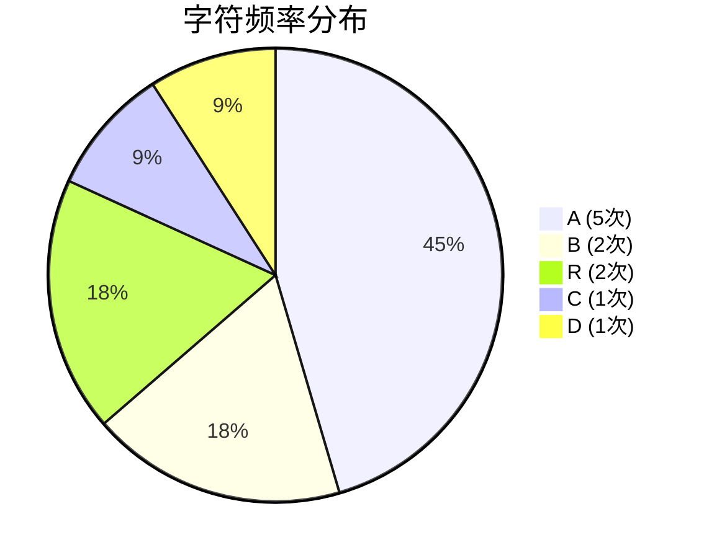
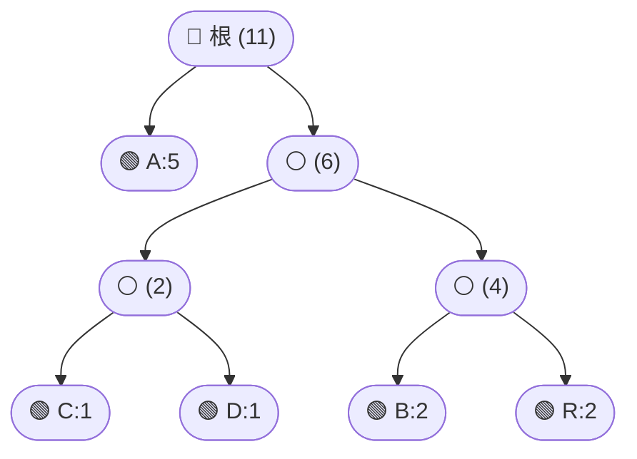

## 概述

**霍夫曼编码（Huffman Coding）** 是一种最优前缀码构造方法。它根据字符出现频率构建不等长编码——频率高的字符码长短，频率低的码长长，从而实现无损数据压缩。核心思想是**贪心地合并两棵最小权值的子树**，自底向上构建编码树。

> 📚 **前置知识**
> - **二叉树**：存储编码结构
> - **最小堆 / 优先队列**：高效取出频率最小的节点
> - **前缀码**：任一编码不是另一编码的前缀，保证解码唯一性

---

## 问题定义

给定字符及其频率，构造一套二进制前缀码，使编码后总长度最小。

| 要素 | 说明 |
|------|------|
| 输入 | 字符频率表（如 `A:5, B:2, R:2, C:1, D:1`） |
| 输出 | 每个字符的二进制编码，以及编码 / 解码算法 |
| 应用 | 文件压缩（ZIP）、图像压缩（JPEG 熵编码步骤） |

---

## 核心原理：分步图解

以字符串 `"ABRACADABRA"` 为例，首先统计字符频率：



### 霍夫曼树构建流程（贪心策略）

1. 每个字符构建为叶子节点，全部加入**最小堆**（按频率排序）。
2. 每次取出频率最小的两个节点，合并为新节点（频率 = 两者之和），放回堆中。
3. 重复直到堆中只剩一个节点，即为**根节点**。

最终构建出的霍夫曼树：



> 🌿 绿色节点为**叶子节点**（存储实际字符），白色节点为内部合并节点。

### 生成编码

从根节点出发，规定：

- 走**左分支**记作 `0`
- 走**右分支**记作 `1`

得到编码表：

| 字符 | 路径 | 编码 | 码长 |
|------|------|------|------|
| A | 左 | `0` | 1 bit |
| B | 右→左 | `10` | 2 bits |
| R | 右→右 | `11` | 2 bits |
| C | 右→左→左 | `100` | 3 bits |
| D | 右→左→右 | `101` | 3 bits |

> 💡 高频字符 A 仅用 1 bit，低频字符 C/D 用 3 bits——这正是"按频率分配码长"的直观体现。

---

## 算法精细步骤

```
算法：BuildHuffmanTree(freqMap)
输入：字符→频率的映射表
输出：霍夫曼树的根节点

1. 初始化最小堆 H
2. for each (char, freq) in freqMap:
3.     H.push( new HuffmanNode(char, freq) )
4. while H.size() > 1:
5.     left  ← H.pop()     // 最小频率节点
6.     right ← H.pop()     // 次小频率节点
7.     merged ← new HuffmanNode(null, left.freq + right.freq, left, right)
8.     H.push(merged)
9. return H.pop()          // 根节点
```

**复杂度分析**：

| 操作 | 时间复杂度 | 说明 |
|------|-----------|------|
| 建堆 | O(n) | n 个字符节点一次性堆化 |
| 合并循环 | O(n log n) | 每次 pop/push 为 O(log n)，共 n-1 次合并 |
| 编码生成 | O(n) | 一次 DFS 遍历树 |
| 编码 / 解码 | O(m) | m 为编码后比特串长度 |
| 空间复杂度 | O(n) | 存储树和编码表 |

---

## TypeScript 实现

### 1. 节点与类型定义

```typescript
class HuffmanNode {
  char: string | null;      // 非 null 表示叶子节点
  freq: number;             // 节点权值（频率之和）
  left: HuffmanNode | null;
  right: HuffmanNode | null;

  constructor(
    char: string | null,
    freq: number,
    left: HuffmanNode | null = null,
    right: HuffmanNode | null = null
  ) {
    this.char = char;
    this.freq = freq;
    this.left = left;
    this.right = right;
  }

  /** 判断是否为叶子节点 */
  isLeaf(): boolean {
    return this.char !== null;
  }
}
```

### 2. 最小堆（优先队列）

```typescript
class MinHeap {
  private heap: HuffmanNode[] = [];

  size(): number {
    return this.heap.length;
  }

  push(node: HuffmanNode): void {
    this.heap.push(node);
    this.bubbleUp(this.heap.length - 1);
  }

  pop(): HuffmanNode {
    if (this.size() === 1) return this.heap.pop()!;
    const top = this.heap[0];
    this.heap[0] = this.heap.pop()!;
    this.bubbleDown(0);
    return top;
  }

  private swap(i: number, j: number): void {
    [this.heap[i], this.heap[j]] = [this.heap[j], this.heap[i]];
  }

  private bubbleUp(idx: number): void {
    while (idx > 0) {
      const parent = Math.floor((idx - 1) / 2);
      if (this.heap[idx].freq >= this.heap[parent].freq) break;
      this.swap(idx, parent);
      idx = parent;
    }
  }

  private bubbleDown(idx: number): void {
    while (true) {
      const left = idx * 2 + 1;
      const right = idx * 2 + 2;
      let smallest = idx;

      if (left < this.size() && this.heap[left].freq < this.heap[smallest].freq)
        smallest = left;
      if (right < this.size() && this.heap[right].freq < this.heap[smallest].freq)
        smallest = right;
      if (smallest === idx) break;

      this.swap(idx, smallest);
      idx = smallest;
    }
  }
}
```

### 3. 构建霍夫曼树

```typescript
function buildHuffmanTree(freqMap: Map<string, number>): HuffmanNode {
  const heap = new MinHeap();

  // 将所有字符节点加入最小堆
  for (const [char, freq] of freqMap) {
    heap.push(new HuffmanNode(char, freq));
  }

  // 贪心合并，直到只剩一个根节点
  while (heap.size() > 1) {
    const left = heap.pop();   // 最小
    const right = heap.pop();  // 次小
    const merged = new HuffmanNode(
      null,
      left.freq + right.freq,
      left,
      right
    );
    heap.push(merged);
  }

  return heap.pop();
}
```

### 4. 生成编码表

```typescript
function generateCodes(root: HuffmanNode): Map<string, string> {
  const codes = new Map<string, string>();

  function dfs(node: HuffmanNode, path: string): void {
    if (node.isLeaf()) {
      // 单字符输入时，编码设为 "0"（否则 path 为空串）
      codes.set(node.char!, path || '0');
      return;
    }
    if (node.left) dfs(node.left, path + '0');
    if (node.right) dfs(node.right, path + '1');
  }

  dfs(root, '');
  return codes;
}
```

### 5. 编码与解码

```typescript
function encode(text: string, codes: Map<string, string>): string {
  let result = '';
  for (const ch of text) {
    const code = codes.get(ch);
    if (code === undefined) {
      throw new Error(`字符 '${ch}' 不在编码表中`);
    }
    result += code;
  }
  return result;
}

function decode(bits: string, root: HuffmanNode): string {
  let result = '';
  let node = root;

  for (const bit of bits) {
    node = bit === '0' ? node.left! : node.right!;

    if (node.isLeaf()) {
      result += node.char;
      node = root; // 回到根节点，继续解码下一个字符
    }
  }

  if (node !== root) {
    throw new Error('解码失败：编码序列不完整');
  }

  return result;
}
```

### 6. 完整运行示例

```typescript
// ===== 测试 =====
const text = "ABRACADABRA";

// 1. 统计频率
const freqMap = new Map<string, number>();
for (const ch of text) {
  freqMap.set(ch, (freqMap.get(ch) || 0) + 1);
}
console.log('频率表:', freqMap);
// Map { 'A' => 5, 'B' => 2, 'R' => 2, 'C' => 1, 'D' => 1 }

// 2. 构建霍夫曼树
const root = buildHuffmanTree(freqMap);

// 3. 生成编码表
const codes = generateCodes(root);
console.log('编码表:', codes);
// Map { 'A' => '0', 'B' => '10', 'R' => '11', 'C' => '100', 'D' => '101' }

// 4. 编码
const encoded = encode(text, codes);
console.log('编码结果:', encoded);
console.log('编码长度:', encoded.length, 'bits');
// 编码结果: 010110010011001011010
// 编码长度: 21 bits
// 原始 ASCII: 11 × 8 = 88 bits → 压缩至 23.9%

// 5. 解码验证
const decoded = decode(encoded, root);
console.log('解码结果:', decoded);
console.log('验证通过:', decoded === text);
// 解码结果: ABRACADABRA
// 验证通过: true
```

---

## 工程优化：规范霍夫曼编码

在实际工程（如 ZIP、JPEG）中，通常使用 **规范霍夫曼编码（Canonical Huffman）** 来减少编码表的存储开销：

- 只存储每个字符的**码长**，而非完整编码
- 按码长和字典序重新分配编码值
- 解码端可通过码长信息重建编码表

规范版本可将编码表从 O(n × 码长) 压缩到 O(n)，是生产环境的标准做法。

---

## 应用与局限

### ✅ 典型应用

- **ZIP / GZIP**：DEFLATE 算法的熵编码阶段
- **PNG**：图像无损压缩
- **JPEG**：DCT 系数熵编码
- **HTTP/2**：HPACK 头部压缩中的霍夫曼编码

### ⚠️ 局限性

| 局限 | 说明 |
|------|------|
| 需预知频率 | 对动态数据流需自适应版本（Adaptive Huffman） |
| 单字符编码 | 未利用字符间上下文相关性 |
| 脆弱性 | 1 bit 错误可能导致后续全部解码错乱 |

---

## 总结


**核心要点**：

1. **贪心策略**：每次合并当前最小的两棵子树，自底向上构建最优树。
2. **数据结构**：最小堆（O(log n) 插入 / 删除）+ 二叉树遍历。
3. **最优性保证**：霍夫曼编码可在数学上证明为前缀码中最优的。
4. **工程落地**：实际使用规范版本减少编码表存储。

> 掌握霍夫曼编码不仅理解了一类压缩算法的基石，也加深了对**贪心算法**和**树结构**的理解。建议结合 DEFLATE 源码或 PNG 规范进一步学习其工程实现。


