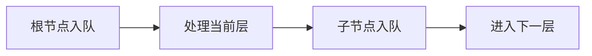

## 概述

层序遍历是二叉树上的 BFS。它按层从上到下、从左到右访问节点，非常适合处理“每一层”的问题。

与递归 DFS 不同，层序遍历使用队列维护当前待访问节点。队列先进先出的特性，刚好对应树的层级顺序。

常见变体包括：每层节点列表、锯齿形遍历、右视图、每层最大值、每层平均值。

> 前置知识
> - **二叉树**：层序遍历按深度访问节点
> - **队列**：先进先出保证同层顺序
> - **BFS**：层序遍历是树上的广度优先搜索

---

## 问题定义

给定二叉树：

```text
      3
     / \
    9   20
       /  \
      15   7
```

层序遍历结果是：

```text
[
  [3],
  [9, 20],
  [15, 7]
]
```

问题的关键是：如何知道当前层有多少个节点？

答案是：在处理每一层之前，先记录队列当前长度。这个长度就是当前层节点数。

---

## 核心原理：分步图解

初始时，队列只有根节点：

```text
queue: [3]
```

处理第 1 层，弹出 `3`，把子节点加入队列：

```text
result: [[3]]
queue: [9, 20]
```

处理第 2 层时，先记录 `levelSize = 2`，只处理这两个节点。它们产生的子节点属于下一层：

```text
result: [[3], [9, 20]]
queue: [15, 7]
```

队列天然保证了从上到下的顺序，而 `levelSize` 划定了每一层的边界。

---

## 算法精细步骤

标准层序遍历：

1. 如果根节点为空，返回空数组；
2. 将根节点入队；
3. 当队列不为空时，记录当前队列长度；
4. 循环处理当前层的所有节点；
5. 弹出节点，记录值；
6. 将它的非空左右子节点入队；
7. 当前层处理完成后，把层结果加入答案。

复杂度：

- 时间复杂度 O(n)，每个节点入队出队一次；
- 空间复杂度 O(w)，`w` 是树的最大宽度。

---

## TypeScript 实现

```typescript
class TreeNode<T> {
  constructor(
    public value: T,
    public left: TreeNode<T> | null = null,
    public right: TreeNode<T> | null = null,
  ) {}
}
```

### 1. 标准层序遍历

```typescript
function levelOrder<T>(root: TreeNode<T> | null): T[][] {
  if (root === null) return [];

  const result: T[][] = [];
  const queue: TreeNode<T>[] = [root];
  let head = 0;

  while (head < queue.length) {
    const levelSize = queue.length - head;
    const level: T[] = [];

    for (let i = 0; i < levelSize; i++) {
      const node = queue[head++];
      level.push(node.value);

      if (node.left) queue.push(node.left);
      if (node.right) queue.push(node.right);
    }

    result.push(level);
  }

  return result;
}
```

### 2. 右视图

```typescript
function rightSideView<T>(root: TreeNode<T> | null): T[] {
  return levelOrder(root).map(level => level[level.length - 1]);
}
```

### 3. 锯齿形层序遍历

```typescript
function zigzagLevelOrder<T>(root: TreeNode<T> | null): T[][] {
  const levels = levelOrder(root);

  for (let i = 1; i < levels.length; i += 2) {
    levels[i].reverse();
  }

  return levels;
}
```

---

## 工程优化：队列不要频繁 shift

很多示例会这样写：

```typescript
const node = queue.shift();
```

这在小数据下没问题，但 `shift` 会移动数组元素，频繁调用可能带来 O(n) 成本。更稳妥的方式是使用 `head` 指针：

```typescript
const node = queue[head++];
```

这种方式把队列出队变成 O(1)，特别适合节点数量较大的树或图。

---

## 应用与局限

### 典型应用

- 二叉树层序遍历；
- 求每层最大值、平均值、宽度；
- 二叉树右视图和左视图；
- 最短路径类 BFS；
- 按层处理任务或依赖关系。

### 局限性

- 队列空间取决于最大层宽，宽树会占用较多内存；
- 层序遍历不适合需要自底向上汇总的问题；
- 如果需要路径回溯，DFS 通常更自然；
- 直接 `shift` 实现队列可能造成隐藏性能问题。

---

## 总结



- 层序遍历是二叉树上的 BFS。
- 队列保证访问顺序，`levelSize` 划分层边界。
- 每个节点只入队出队一次，时间复杂度 O(n)。
- 用头指针替代 `shift` 能避免数组搬移成本。
- 层序遍历适合所有“按层统计或观察”的问题。
