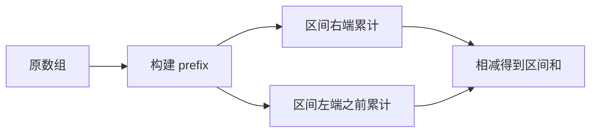
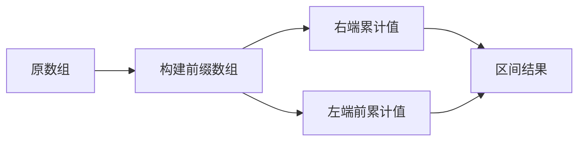

## 概述

**前缀和（Prefix Sum）** 是一种预处理技巧：先把从开头到当前位置的累计值存下来，之后任意连续区间的和都可以通过两次查询相减得到。

> 前置知识
> - **数组下标**：前缀数组通常多开一位，降低边界处理成本
> - **区间表示**：明确 `[l, r]` 与 `[l, r)` 的差异
> - **哈希表**：用于统计前缀和出现次数，解决“和为 K 的子数组”

---

## 问题定义

给定数组和多次区间查询，快速计算任意连续区间的和或相关累计值。

| 要素 | 说明 |
|------|------|
| 输入 | 原数组、区间端点、目标和 |
| 输出 | 区间和、满足条件的子数组数量或派生累计值 |
| 预处理 | `prefix[i + 1] = prefix[i] + nums[i]` |
| 查询公式 | `sum(l, r) = prefix[r + 1] - prefix[l]` |

---

## 核心原理：分步图解

以数组 `[1, 3, 5, 2, 4]` 为例：

```text
nums:    1   3   5   2   4
index:   0   1   2   3   4
prefix: 0   1   4   9   11  15
```

查询区间 `nums[1..3]`：

```text
prefix[4] - prefix[1] = 11 - 1 = 10
nums[1] + nums[2] + nums[3] = 3 + 5 + 2 = 10
```



多开一位 `prefix[0] = 0` 的好处是：从下标 `0` 开始的区间也能使用同一个公式。

---

## 算法精细步骤

```
算法：PrefixSum(nums)
输入：数组 nums
输出：可 O(1) 查询区间和的前缀数组

1. 创建长度为 nums.length + 1 的数组 prefix，初始为 0
2. for i from 0 to nums.length - 1:
3.     prefix[i + 1] ← prefix[i] + nums[i]
4. 查询 [l, r] 时返回 prefix[r + 1] - prefix[l]
```

**复杂度分析**：

| 操作 | 时间复杂度 | 空间复杂度 | 说明 |
|------|------|------|------|
| 构建前缀和 | O(n) | O(n) | 一次线性扫描 |
| 单次区间查询 | O(1) | O(1) | 两个前缀值相减 |
| m 次区间查询 | O(n + m) | O(n) | 先预处理再查询 |
| 子数组和为 K | O(n) | O(n) | 前缀和 + 哈希计数 |

---

## TypeScript 实现

### 1. 基础前缀和

```typescript
function buildPrefixSum(nums: number[]): number[] {
  const prefix = new Array(nums.length + 1).fill(0);

  for (let i = 0; i < nums.length; i++) {
    prefix[i + 1] = prefix[i] + nums[i];
  }

  return prefix;
}

function rangeSum(prefix: number[], left: number, right: number): number {
  return prefix[right + 1] - prefix[left];
}
```

### 2. 区域和检索

```typescript
class NumArray {
  private prefix: number[];

  constructor(nums: number[]) {
    this.prefix = buildPrefixSum(nums);
  }

  sumRange(left: number, right: number): number {
    return this.prefix[right + 1] - this.prefix[left];
  }
}
```

### 3. 和为 K 的子数组

```typescript
function subarraySum(nums: number[], k: number): number {
  const countByPrefix = new Map<number, number>();
  countByPrefix.set(0, 1);

  let prefix = 0;
  let count = 0;

  for (const num of nums) {
    prefix += num;
    count += countByPrefix.get(prefix - k) ?? 0;
    countByPrefix.set(prefix, (countByPrefix.get(prefix) ?? 0) + 1);
  }

  return count;
}
```

### 4. 最大子数组和的前缀视角

```typescript
function maxSubArray(nums: number[]): number {
  let prefix = 0;
  let minPrefix = 0;
  let best = nums[0];

  for (const num of nums) {
    prefix += num;
    best = Math.max(best, prefix - minPrefix);
    minPrefix = Math.min(minPrefix, prefix);
  }

  return best;
}
```

### 5. 前缀积变体

```typescript
function productExceptSelf(nums: number[]): number[] {
  const result = new Array(nums.length).fill(1);

  let leftProduct = 1;
  for (let i = 0; i < nums.length; i++) {
    result[i] = leftProduct;
    leftProduct *= nums[i];
  }

  let rightProduct = 1;
  for (let i = nums.length - 1; i >= 0; i--) {
    result[i] *= rightProduct;
    rightProduct *= nums[i];
  }

  return result;
}
```

---

## 工程优化：统一区间语义

前缀和最常见的 bug 来自端点混乱。推荐统一使用“前缀数组多一位 + 查询闭区间 `[left, right]`”的写法。

| 场景 | 推荐表达 | 原因 |
|------|------|------|
| 一维区间和 | `prefix[right + 1] - prefix[left]` | 覆盖从 0 开始的区间 |
| 子数组计数 | `prefix - k` | 把区间和转化为历史前缀查询 |
| 二维前缀和 | 多加一行一列 | 避免上边界和左边界特判 |
| 频繁更新 | 不适合普通前缀和 | 可改用树状数组或线段树 |

如果数组会频繁修改，普通前缀和每次更新后都要重建，应该换成支持动态更新的数据结构。

---

## 应用与局限

### 典型应用

- 多次静态区间求和
- 子数组和为 K、连续区间计数
- 二维矩阵区域求和
- 前缀异或、前缀积、前缀最值等变体

### 局限性

| 局限 | 说明 |
|------|------|
| 不适合频繁单点更新 | 更新一个值会影响后续所有前缀 |
| 只适合可逆或可累计运算 | 区间和可相减，最大值不能直接相减 |
| 需要额外空间 | 一般需要 O(n) 预处理数组 |

---

## 总结



**核心要点**：

1. 前缀和 = 预处理累计值 + O(1) 区间查询。
2. 多开一位 `prefix[0] = 0` 可以统一边界公式。
3. 前缀和 + 哈希表是“子数组和为 K”的核心模型。
4. 静态查询用前缀和，动态更新要考虑树状数组或线段树。
