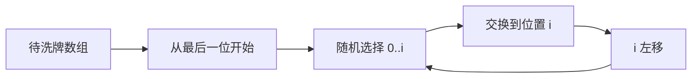
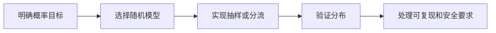

## 概述

**随机算法（Randomized Algorithms）** 利用随机数做选择、抽样或近似估计。它们常用于打乱顺序、从数据流中均匀抽样、按权重分配流量，以及用随机采样估算复杂结果。

> 前置知识
> - **概率基础**：理解均匀分布和加权概率
> - **前缀和 / 二分**：用于高效加权随机选择
> - **哈希函数**：用于稳定分流，而不是每次完全随机

---

## 问题定义

在不确定性参与的场景中，设计满足概率要求的算法，并控制时间、空间和稳定性。

| 要素 | 说明 |
|------|------|
| 输入 | 数组、数据流、权重表或采样次数 |
| 输出 | 随机排列、随机样本、加权结果或近似值 |
| 核心要求 | 概率正确、复杂度可控、必要时可复现 |
| 典型算法 | Fisher-Yates、蓄水池抽样、加权随机、蒙特卡洛 |

---

## 核心原理：分步图解

Fisher-Yates 洗牌从后往前固定位置，每次在 `[0, i]` 中等概率选一个元素交换：



因为第 `i` 个位置从剩余 `i + 1` 个元素中等概率选择，所以每个排列出现概率相同。

---

## 算法精细步骤

```
算法：FisherYatesShuffle(arr)
输入：数组 arr
输出：原地打乱后的数组

1. for i from arr.length - 1 downto 1:
2.     j ← random integer in [0, i]
3.     swap arr[i] and arr[j]
4. return arr
```

**复杂度分析**：

| 算法 | 时间复杂度 | 空间复杂度 | 适用场景 |
|------|------|------|------|
| Fisher-Yates | O(n) | O(1) | 均匀随机排列 |
| 蓄水池抽样 | O(n) | O(k) | 未知长度数据流抽样 |
| 加权随机线性版 | O(n) | O(1) | 少量选择 |
| 前缀和 + 二分 | O(log n) / 次 | O(n) | 多次加权选择 |
| 蒙特卡洛 | O(samples) | O(1) | 近似估计 |

---

## TypeScript 实现

### 1. Fisher-Yates 洗牌

```typescript
function shuffle<T>(arr: T[]): T[] {
  for (let i = arr.length - 1; i > 0; i--) {
    const j = Math.floor(Math.random() * (i + 1));
    [arr[i], arr[j]] = [arr[j], arr[i]];
  }

  return arr;
}
```

### 2. 蓄水池抽样

```typescript
function reservoirSampling<T>(stream: T[], k: number): T[] {
  const reservoir: T[] = [];

  for (let i = 0; i < stream.length; i++) {
    if (i < k) {
      reservoir.push(stream[i]);
    } else {
      const j = Math.floor(Math.random() * (i + 1));
      if (j < k) reservoir[j] = stream[i];
    }
  }

  return reservoir;
}
```

### 3. 加权随机选择

```typescript
interface WeightedItem<T> {
  value: T;
  weight: number;
}

function weightedRandom<T>(items: WeightedItem<T>[]): T {
  const total = items.reduce((sum, item) => sum + item.weight, 0);
  let random = Math.random() * total;

  for (const item of items) {
    random -= item.weight;
    if (random <= 0) return item.value;
  }

  return items[items.length - 1].value;
}
```

### 4. 前缀和 + 二分优化

```typescript
class WeightedPicker<T> {
  private values: T[];
  private prefix: number[] = [];
  private total = 0;

  constructor(items: WeightedItem<T>[]) {
    this.values = items.map(item => item.value);

    for (const item of items) {
      this.total += item.weight;
      this.prefix.push(this.total);
    }
  }

  pick(): T {
    const target = Math.random() * this.total;
    let left = 0;
    let right = this.prefix.length - 1;

    while (left < right) {
      const mid = left + Math.floor((right - left) / 2);
      if (this.prefix[mid] < target) left = mid + 1;
      else right = mid;
    }

    return this.values[left];
  }
}
```

### 5. 蒙特卡洛估算 π

```typescript
function estimatePi(samples = 1_000_000): number {
  let inside = 0;

  for (let i = 0; i < samples; i++) {
    const x = Math.random();
    const y = Math.random();
    if (x * x + y * y <= 1) inside++;
  }

  return (inside / samples) * 4;
}
```

### 6. 稳定 A/B 分流

```typescript
class ABTesting {
  private variants: string[];
  private weights: number[];

  constructor(config: Record<string, number>) {
    this.variants = Object.keys(config);
    this.weights = Object.values(config);
  }

  assign(userId: string): string {
    const total = this.weights.reduce((sum, weight) => sum + weight, 0);
    const bucket = this.hashCode(userId) % total;
    let current = 0;

    for (let i = 0; i < this.variants.length; i++) {
      current += this.weights[i];
      if (bucket < current) return this.variants[i];
    }

    return this.variants[this.variants.length - 1];
  }

  private hashCode(str: string): number {
    let hash = 0;
    for (let i = 0; i < str.length; i++) {
      hash = ((hash << 5) - hash + str.charCodeAt(i)) | 0;
    }
    return Math.abs(hash);
  }
}
```

---

## 工程优化：随机性、安全性与可复现

| 场景 | 推荐做法 | 原因 |
|------|------|------|
| 普通 UI 随机 | `Math.random()` | 简单够用 |
| 安全敏感随机 | `crypto.getRandomValues()` | `Math.random()` 不适合安全用途 |
| A/B 测试 | 用户 ID 哈希 | 保证同一用户稳定分组 |
| 测试随机算法 | 注入随机数生成器 | 便于复现和单元测试 |
| 多次加权选择 | 前缀和 + 二分 | 预处理后单次 O(log n) |

随机算法的正确性通常是概率意义上的，不应只用单次结果判断实现是否正确。

---

## 应用与局限

### 典型应用

- 列表洗牌、随机播放、抽奖
- 日志流、数据流抽样
- A/B 测试和灰度分流
- 蒙特卡洛估计、随机化 QuickSelect

### 局限性

| 局限 | 说明 |
|------|------|
| 结果不稳定 | 需要可复现时必须控制随机源 |
| 概率验证困难 | 需要统计测试而不是单个样例 |
| 安全要求不同 | 业务随机和密码学随机不能混用 |

---

## 总结



**核心要点**：

1. Fisher-Yates 是均匀洗牌的标准算法。
2. 蓄水池抽样适合未知长度的数据流。
3. 多次加权选择可用前缀和和二分优化。
4. 安全场景不要使用 `Math.random()`。
