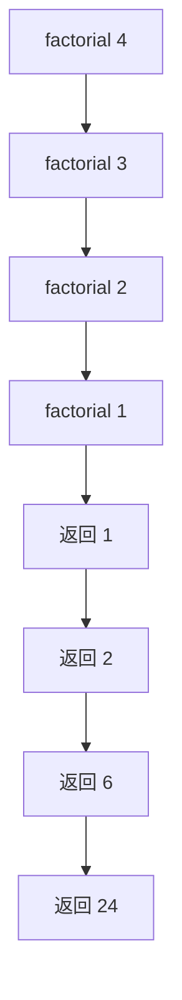

## 概述

**递归（Recursion）** 是函数直接或间接调用自身的编程方法。它把大问题拆成结构相同的小问题，再通过终止条件停止拆分，并在返回过程中组合结果。

> 前置知识
> - **调用栈**：每次递归调用都会保存当前执行上下文
> - **分治思想**：递归常用于把问题拆成相同结构的子问题
> - **树结构**：树的定义天然递归，遍历也最适合递归表达

---

## 问题定义

当问题可以被描述为“当前答案依赖更小规模的同类问题”时，可以考虑递归。

| 要素 | 说明 |
|------|------|
| 输入 | 当前问题规模或当前节点 |
| 输出 | 当前规模下的结果 |
| 终止条件 | 最小问题的直接答案 |
| 递推关系 | 当前结果如何由子问题得到 |

---

## 核心原理：分步图解

以阶乘 `factorial(4)` 为例：



递归包含两个方向：

1. **递进**：不断把问题拆小，直到命中终止条件。
2. **回归**：子问题返回结果后，逐层合并成最终答案。

如果终止条件不可达，递归会无限调用，最终栈溢出。

---

## 算法精细步骤

```
算法：RecursiveSolve(problem)
输入：当前问题 problem
输出：problem 的答案

1. 如果 problem 是最小问题，返回已知答案
2. 将 problem 转化为一个或多个更小的同类问题
3. 递归求解子问题
4. 将子问题结果组合成当前问题答案
5. 返回答案
```

**复杂度分析**：

| 示例 | 时间复杂度 | 空间复杂度 | 说明 |
|------|------|------|------|
| 阶乘 | O(n) | O(n) | 递归深度为 n |
| 朴素斐波那契 | O(2^n) | O(n) | 大量重复计算 |
| 记忆化斐波那契 | O(n) | O(n) | 缓存每个子问题 |
| 二叉树深度 | O(n) | O(h) | h 为树高 |
| 快速幂 | O(log n) | O(log n) | 每次规模减半 |

---

## TypeScript 实现

### 1. 阶乘

```typescript
function factorial(n: number): number {
  if (n <= 1) return 1;
  return n * factorial(n - 1);
}
```

### 2. 斐波那契与记忆化

```typescript
function fib(n: number): number {
  if (n <= 1) return n;
  return fib(n - 1) + fib(n - 2);
}

function fibMemo(n: number, memo = new Map<number, number>()): number {
  if (n <= 1) return n;
  if (memo.has(n)) return memo.get(n)!;

  const value = fibMemo(n - 1, memo) + fibMemo(n - 2, memo);
  memo.set(n, value);
  return value;
}
```

### 3. 汉诺塔

```typescript
function hanoi(n: number, from: string, to: string, via: string): void {
  if (n === 1) {
    console.log(`${from} -> ${to}`);
    return;
  }

  hanoi(n - 1, from, via, to);
  console.log(`${from} -> ${to}`);
  hanoi(n - 1, via, to, from);
}
```

### 4. 快速幂

```typescript
function myPow(x: number, n: number): number {
  if (n === 0) return 1;
  if (n < 0) return 1 / myPow(x, -n);

  const half = myPow(x, Math.floor(n / 2));
  return n % 2 === 0 ? half * half : half * half * x;
}
```

### 5. 二叉树最大深度

```typescript
interface TreeNode {
  val: number;
  left: TreeNode | null;
  right: TreeNode | null;
}

function maxDepth(root: TreeNode | null): number {
  if (root === null) return 0;
  return 1 + Math.max(maxDepth(root.left), maxDepth(root.right));
}
```

### 6. 递归转迭代

```typescript
function sumRecursive(n: number): number {
  if (n === 0) return 0;
  return n + sumRecursive(n - 1);
}

function sumIterative(n: number): number {
  let sum = 0;
  for (let i = 1; i <= n; i++) {
    sum += i;
  }
  return sum;
}
```

---

## 工程优化：记忆化与栈深度控制

| 问题 | 优化方式 | 说明 |
|------|------|------|
| 重复计算 | 记忆化搜索 | 用 Map 缓存子问题结果 |
| 栈深度过大 | 改写为迭代 | 避免调用栈溢出 |
| 尾部递归 | 累加器参数 | JavaScript 引擎不保证尾调用优化 |
| 全局状态污染 | 参数传递 / 局部变量 | 递归函数更可复用 |

尾递归写法更接近迭代，但在 JavaScript/TypeScript 环境中不能依赖运行时自动优化调用栈。

---

## 应用与局限

### 典型应用

- 树和图的遍历
- 分治算法：归并排序、快速排序、快速幂
- 动态规划的记忆化搜索版本
- 回溯与组合枚举

### 局限性

| 局限 | 说明 |
|------|------|
| 栈溢出 | 深度过大时调用栈不可控 |
| 重复计算 | 朴素递归可能指数级退化 |
| 调试成本 | 多层调用时状态追踪较难 |

---

## 总结


**核心要点**：

1. 递归三要素是终止条件、递推关系和返回值。
2. 递归适合树形、分治、回溯等天然分层的问题。
3. 重叠子问题要加记忆化，避免指数级重复计算。
4. 深度不可控时，优先改写为显式栈或迭代。
