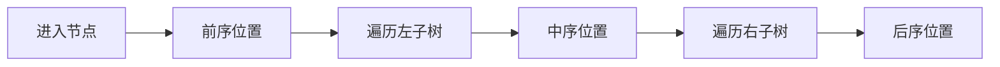

## 概述

递归遍历是理解二叉树的基础。前序、中序、后序三种遍历的区别，不在于访问了哪些节点，而在于“什么时候处理当前节点”。

三种顺序分别是：

- 前序：先处理当前节点，再处理左右子树；
- 中序：先处理左子树，再处理当前节点，最后处理右子树；
- 后序：先处理左右子树，最后处理当前节点。

掌握这三种顺序后，很多树形问题都能转化成选择合适的处理时机。

> 前置知识
> - **递归调用栈**：保存当前节点和返回位置
> - **二叉树结构**：遍历顺序围绕根、左、右展开
> - **访问时机**：前序、中序、后序只差处理当前节点的位置

---

## 问题定义

给定一棵二叉树：

```text
      A
     / \
    B   C
   / \
  D   E
```

不同遍历结果如下：

| 遍历方式 | 顺序 | 结果 |
| --- | --- | --- |
| 前序 | 根 -> 左 -> 右 | A B D E C |
| 中序 | 左 -> 根 -> 右 | D B E A C |
| 后序 | 左 -> 右 -> 根 | D E B C A |

遍历的本质是：每个节点都会经过三次关键位置。

```text
进入节点前
处理完左子树后
处理完右子树后
```

把“访问当前节点”的语句放在哪个位置，就得到哪种遍历。

---

## 核心原理：分步图解

递归函数可以写成一个统一框架：

```typescript
function traverse(node: TreeNode | null): void {
  if (node === null) return;

  // 前序位置
  traverse(node.left);
  // 中序位置
  traverse(node.right);
  // 后序位置
}
```

### 前序位置

适合自顶向下传递信息，例如复制树、序列化、输出目录结构。

### 中序位置

对 BST 特别重要，因为 BST 的中序遍历是升序。

### 后序位置

适合自底向上汇总信息，例如计算高度、判断平衡、释放资源。

---

## 算法精细步骤

写递归遍历时，可以按下面顺序思考：

1. 空节点如何处理；
2. 当前节点应该在前序、中序还是后序位置被访问；
3. 是否需要把状态作为参数向下传递；
4. 是否需要从子树拿返回值向上汇总；
5. 递归深度是否可能过大。

递归的优势是代码贴近树的定义；缺点是调用栈由运行时维护，极深的树可能栈溢出。

---

## TypeScript 实现

```typescript
class TreeNode<T> {
  constructor(
    public value: T,
    public left: TreeNode<T> | null = null,
    public right: TreeNode<T> | null = null,
  ) {}
}
```

### 1. 前序遍历

```typescript
function preorder<T>(root: TreeNode<T> | null): T[] {
  const result: T[] = [];

  function dfs(node: TreeNode<T> | null): void {
    if (node === null) return;

    result.push(node.value);
    dfs(node.left);
    dfs(node.right);
  }

  dfs(root);
  return result;
}
```

### 2. 中序遍历

```typescript
function inorder<T>(root: TreeNode<T> | null): T[] {
  const result: T[] = [];

  function dfs(node: TreeNode<T> | null): void {
    if (node === null) return;

    dfs(node.left);
    result.push(node.value);
    dfs(node.right);
  }

  dfs(root);
  return result;
}
```

### 3. 后序遍历

```typescript
function postorder<T>(root: TreeNode<T> | null): T[] {
  const result: T[] = [];

  function dfs(node: TreeNode<T> | null): void {
    if (node === null) return;

    dfs(node.left);
    dfs(node.right);
    result.push(node.value);
  }

  dfs(root);
  return result;
}
```

---

## 工程优化：递归转迭代

递归依赖调用栈。如果树可能非常深，可以显式使用栈模拟遍历。

```typescript
function preorderIterative<T>(root: TreeNode<T> | null): T[] {
  if (root === null) return [];

  const result: T[] = [];
  const stack: TreeNode<T>[] = [root];

  while (stack.length > 0) {
    const node = stack.pop()!;
    result.push(node.value);

    if (node.right) stack.push(node.right);
    if (node.left) stack.push(node.left);
  }

  return result;
}
```

因为栈是后进先出，所以要先压入右子节点，再压入左子节点，才能保证左子树先被处理。

---

## 应用与局限

### 典型应用

- 前序：复制树、序列化、打印层级结构；
- 中序：BST 升序遍历、验证 BST、找第 K 小；
- 后序：计算高度、判断平衡、删除或释放树；
- 迭代遍历：避免深树递归栈溢出。

### 局限性

- 递归深度受运行时调用栈限制；
- 闭包状态过多时不易调试；
- 中序遍历只对 BST 有天然排序意义；
- 迭代写法更冗长，容易压栈顺序出错。

---

## 总结



- 前序、中序、后序的区别是处理当前节点的位置。
- 二叉树递归框架能统一三种遍历。
- 前序适合自顶向下，中序适合 BST，后序适合自底向上。
- 深树场景可以用显式栈改写递归。
