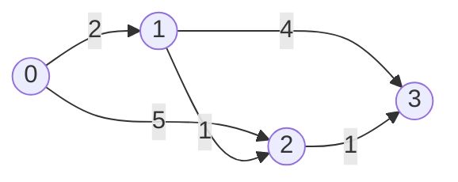
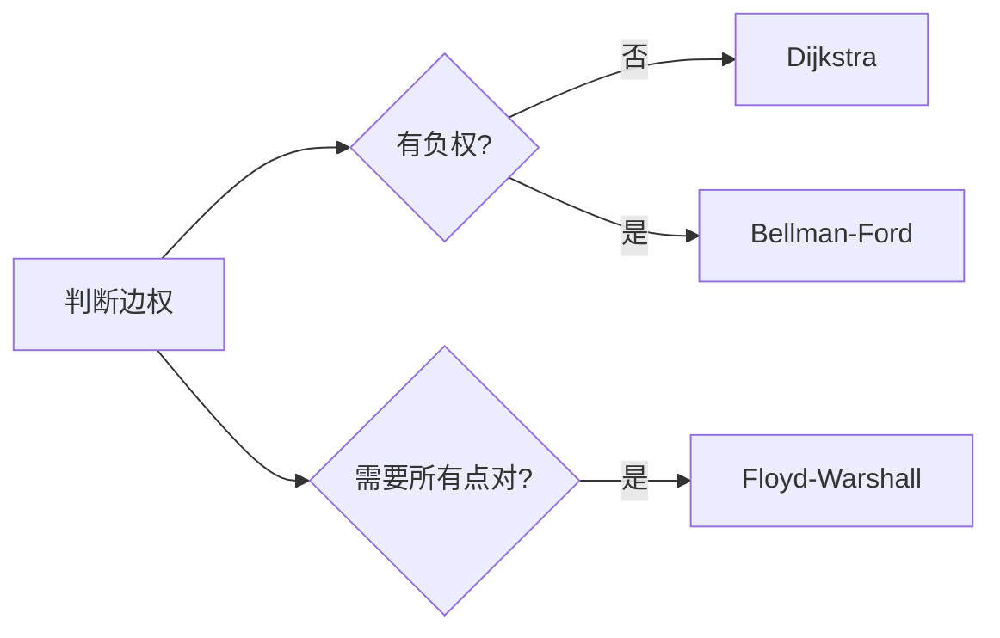

## 概述

**最短路径** 研究图中从一个点到另一个点的最低代价路径。根据边权是否为负、是否需要所有点对结果，常用算法包括 Dijkstra、Bellman-Ford 和 Floyd-Warshall。

> 前置知识
> - **图的邻接表 / 边列表**：不同算法适合不同表示
> - **松弛操作**：用更短路径更新距离
> - **优先队列**：用于优化 Dijkstra 的最小距离节点选择

---

## 问题定义

给定带权图、起点和终点或全部节点，计算路径权重之和最小的路径长度。

| 要素 | 说明 |
|------|------|
| 输入 | 顶点、带权边、起点或所有点 |
| 输出 | 单源距离数组、某个目标距离或所有点对距离矩阵 |
| 核心操作 | 松弛：`dist[v] = min(dist[v], dist[u] + w)` |
| 算法选择 | 无负权用 Dijkstra，有负权用 Bellman-Ford，多源用 Floyd |

---

## 核心原理：分步图解

Dijkstra 每次确定当前未访问节点中距离最小的点：



从 `0` 出发：

1. 初始 `dist[0] = 0`，其他为无穷大。
2. 选择距离最小的未确定节点。
3. 用它的出边更新邻居距离。
4. 重复直到所有可达节点确定。

Dijkstra 依赖“当前最短节点不会再被更新”的贪心性质，因此不能处理负权边。

---

## 算法精细步骤

```
算法：Dijkstra(graph, start)
输入：非负权图 graph，起点 start
输出：start 到每个节点的最短距离

1. dist 全部初始化为 Infinity，dist[start] = 0
2. 将 [start, 0] 加入优先队列
3. while 队列不为空：
4.     取出距离最小的节点 u
5.     如果该距离已过期，跳过
6.     遍历 u 的所有边 u -> v, 权重 w：
7.         如果 dist[u] + w < dist[v]：
8.             更新 dist[v] 并加入队列
9. 返回 dist
```

**复杂度分析**：

| 算法 | 适用场景 | 时间复杂度 | 空间复杂度 |
|------|------|------|------|
| Dijkstra 朴素版 | 无负权、稠密图 | O(V² + E) | O(V) |
| Dijkstra 堆优化 | 无负权、稀疏图 | O(E log V) | O(V + E) |
| Bellman-Ford | 可含负权边 | O(VE) | O(V) |
| Floyd-Warshall | 所有点对 | O(V³) | O(V²) |

---

## TypeScript 实现

### 1. 图类型与朴素 Dijkstra

```typescript
type WeightedGraph = [number, number][][];

function dijkstra(graph: WeightedGraph, start: number): number[] {
  const n = graph.length;
  const dist = new Array(n).fill(Infinity);
  const visited = new Array(n).fill(false);
  dist[start] = 0;

  for (let i = 0; i < n; i++) {
    let u = -1;
    for (let j = 0; j < n; j++) {
      if (!visited[j] && (u === -1 || dist[j] < dist[u])) u = j;
    }

    if (u === -1 || dist[u] === Infinity) break;
    visited[u] = true;

    for (const [v, weight] of graph[u]) {
      if (dist[u] + weight < dist[v]) {
        dist[v] = dist[u] + weight;
      }
    }
  }

  return dist;
}
```

### 2. 堆优化 Dijkstra

```typescript
class MinHeap {
  private heap: [number, number][] = [];

  push(item: [number, number]): void {
    this.heap.push(item);
    this.bubbleUp(this.heap.length - 1);
  }

  pop(): [number, number] | undefined {
    if (this.heap.length === 0) return undefined;
    if (this.heap.length === 1) return this.heap.pop();

    const top = this.heap[0];
    this.heap[0] = this.heap.pop()!;
    this.bubbleDown(0);
    return top;
  }

  get size(): number {
    return this.heap.length;
  }

  private bubbleUp(index: number): void {
    while (index > 0) {
      const parent = Math.floor((index - 1) / 2);
      if (this.heap[parent][1] <= this.heap[index][1]) break;
      [this.heap[parent], this.heap[index]] = [this.heap[index], this.heap[parent]];
      index = parent;
    }
  }

  private bubbleDown(index: number): void {
    while (true) {
      const left = index * 2 + 1;
      const right = index * 2 + 2;
      let smallest = index;

      if (left < this.heap.length && this.heap[left][1] < this.heap[smallest][1]) smallest = left;
      if (right < this.heap.length && this.heap[right][1] < this.heap[smallest][1]) smallest = right;
      if (smallest === index) break;

      [this.heap[smallest], this.heap[index]] = [this.heap[index], this.heap[smallest]];
      index = smallest;
    }
  }
}

function dijkstraHeap(graph: WeightedGraph, start: number): number[] {
  const dist = new Array(graph.length).fill(Infinity);
  const heap = new MinHeap();
  dist[start] = 0;
  heap.push([start, 0]);

  while (heap.size > 0) {
    const [node, distance] = heap.pop()!;
    if (distance > dist[node]) continue;

    for (const [next, weight] of graph[node]) {
      const nextDistance = distance + weight;
      if (nextDistance < dist[next]) {
        dist[next] = nextDistance;
        heap.push([next, nextDistance]);
      }
    }
  }

  return dist;
}
```

### 3. Bellman-Ford

```typescript
function bellmanFord(edges: [number, number, number][], n: number, start: number): number[] {
  const dist = new Array(n).fill(Infinity);
  dist[start] = 0;

  for (let i = 0; i < n - 1; i++) {
    let updated = false;

    for (const [from, to, weight] of edges) {
      if (dist[from] !== Infinity && dist[from] + weight < dist[to]) {
        dist[to] = dist[from] + weight;
        updated = true;
      }
    }

    if (!updated) break;
  }

  for (const [from, to, weight] of edges) {
    if (dist[from] !== Infinity && dist[from] + weight < dist[to]) {
      throw new Error('存在负权环');
    }
  }

  return dist;
}
```

### 4. Floyd-Warshall

```typescript
function floydWarshall(graph: number[][]): number[][] {
  const n = graph.length;
  const dist = graph.map(row => [...row]);

  for (let k = 0; k < n; k++) {
    for (let i = 0; i < n; i++) {
      for (let j = 0; j < n; j++) {
        if (dist[i][k] + dist[k][j] < dist[i][j]) {
          dist[i][j] = dist[i][k] + dist[k][j];
        }
      }
    }
  }

  return dist;
}
```

---

## 工程优化：按图类型选算法

| 图特征 | 推荐算法 | 原因 |
|------|------|------|
| 非负权单源 | Dijkstra + 优先队列 | 速度快，最常用 |
| 有负权边 | Bellman-Ford | 能检测负权环 |
| 所有点对 | Floyd-Warshall | 实现简单，适合节点较少 |
| 边权都为 1 | BFS | 不需要最短路径权重算法 |
| 0/1 边权 | 0-1 BFS | 可用双端队列优化 |

实际工程中还要注意距离溢出、不可达节点表示、图是否为有向图，以及输入节点编号是否从 0 开始。

---

## 应用与局限

### 典型应用

- 地图导航、路由规划
- 网络延迟时间、任务链路成本
- 游戏寻路、图上资源分配
- 多源距离预处理

### 局限性

| 局限 | 说明 |
|------|------|
| Dijkstra 不支持负权 | 负权会破坏贪心正确性 |
| Floyd 成本高 | O(V³) 只适合节点数较小的图 |
| 图建模影响结果 | 边方向、权重和节点编号必须定义清楚 |

---

## 总结



**核心要点**：

1. 最短路径的核心操作是松弛边。
2. 无负权单源最短路优先使用 Dijkstra。
3. 有负权边时使用 Bellman-Ford，并检测负权环。
4. 所有点对最短路可用 Floyd，但要接受 O(V³) 成本。
