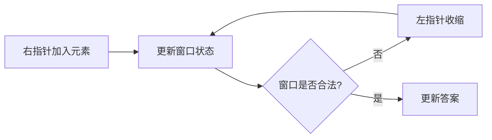

## 概述

**滑动窗口（Sliding Window）** 是双指针在连续区间问题中的常见形式。它维护一个窗口 `[left, right]` 或 `[left, right)`，随着右指针扩张、左指针收缩，在 O(n) 时间内处理子数组或子串问题。

> 前置知识
> - **双指针**：窗口左右边界由两个指针维护
> - **哈希表 / 计数器**：记录窗口内字符或元素状态
> - **区间不变量**：明确窗口当前满足或不满足什么条件

---

## 问题定义

给定数组或字符串，寻找满足某种条件的连续区间，例如最大长度、最小长度、固定长度最优值或覆盖关系。

| 要素 | 说明 |
|------|------|
| 输入 | 数组、字符串、目标长度或约束条件 |
| 输出 | 最长/最短窗口长度、窗口内容或统计值 |
| 核心状态 | `left`、`right`、窗口计数、当前答案 |
| 常见类型 | 定长窗口、变长窗口、覆盖窗口 |

---

## 核心原理：分步图解

以变长窗口为例，右指针负责扩张，左指针负责恢复条件：

```text
s:      a  b  c  a  b  c  b  b
index:  0  1  2  3  4  5  6  7
window: [left ...... right]
```



滑动窗口之所以是 O(n)，是因为每个元素最多被右指针加入一次、被左指针移出一次。

---

## 算法精细步骤

```
算法：VariableSlidingWindow(nums)
输入：数组或字符串 nums
输出：满足条件的最优窗口

1. left ← 0
2. 初始化窗口状态 window
3. for right from 0 to nums.length - 1:
4.     将 nums[right] 加入 window
5.     while window 不满足约束：
6.         将 nums[left] 移出 window
7.         left ← left + 1
8.     用当前窗口更新答案
9. 返回答案
```

**复杂度分析**：

| 窗口类型 | 时间复杂度 | 空间复杂度 | 说明 |
|------|------|------|------|
| 定长窗口 | O(n) | O(1) | 每次进一个、出一个 |
| 变长窗口 | O(n) | O(k) | k 为窗口内不同元素数 |
| 覆盖窗口 | O(n) | O(字符集大小) | 需要维护 need/window 计数 |
| 暴力枚举 | O(n²) 或更高 | O(1) | 枚举所有连续区间 |

---

## TypeScript 实现

### 1. 定长窗口最大和

```typescript
function maxSumSubarray(nums: number[], k: number): number {
  let sum = 0;

  for (let i = 0; i < k; i++) {
    sum += nums[i];
  }

  let best = sum;
  for (let right = k; right < nums.length; right++) {
    sum += nums[right] - nums[right - k];
    best = Math.max(best, sum);
  }

  return best;
}
```

### 2. 最大平均数

```typescript
function findMaxAverage(nums: number[], k: number): number {
  return maxSumSubarray(nums, k) / k;
}
```

### 3. 无重复字符的最长子串

```typescript
function lengthOfLongestSubstring(s: string): number {
  const window = new Map<string, number>();
  let left = 0;
  let best = 0;

  for (let right = 0; right < s.length; right++) {
    const char = s[right];
    window.set(char, (window.get(char) ?? 0) + 1);

    while (window.get(char)! > 1) {
      const removed = s[left];
      window.set(removed, window.get(removed)! - 1);
      left++;
    }

    best = Math.max(best, right - left + 1);
  }

  return best;
}
```

### 4. 长度最小的子数组

```typescript
function minSubArrayLen(target: number, nums: number[]): number {
  let left = 0;
  let sum = 0;
  let best = Infinity;

  for (let right = 0; right < nums.length; right++) {
    sum += nums[right];

    while (sum >= target) {
      best = Math.min(best, right - left + 1);
      sum -= nums[left];
      left++;
    }
  }

  return best === Infinity ? 0 : best;
}
```

### 5. 最小覆盖子串

```typescript
function minWindow(s: string, t: string): string {
  const need = new Map<string, number>();
  const window = new Map<string, number>();

  for (const char of t) {
    need.set(char, (need.get(char) ?? 0) + 1);
  }

  let left = 0;
  let valid = 0;
  let start = 0;
  let minLength = Infinity;

  for (let right = 0; right < s.length; right++) {
    const char = s[right];
    if (need.has(char)) {
      window.set(char, (window.get(char) ?? 0) + 1);
      if (window.get(char) === need.get(char)) valid++;
    }

    while (valid === need.size) {
      if (right - left + 1 < minLength) {
        start = left;
        minLength = right - left + 1;
      }

      const removed = s[left];
      left++;

      if (need.has(removed)) {
        if (window.get(removed) === need.get(removed)) valid--;
        window.set(removed, window.get(removed)! - 1);
      }
    }
  }

  return minLength === Infinity ? '' : s.slice(start, start + minLength);
}
```

---

## 工程优化：窗口状态要可增量维护

滑动窗口的前提是窗口变化时，状态可以快速更新。

| 状态 | 入窗口 | 出窗口 | 适用问题 |
|------|------|------|------|
| 求和 | `sum += x` | `sum -= x` | 子数组和、平均值 |
| 计数 | `count[x]++` | `count[x]--` | 字符覆盖、频率限制 |
| 去重 | 记录出现次数 | 重复时收缩 | 无重复子串 |
| 最大/最小 | 单调队列 | 过期元素出队 | 窗口最大值 |

如果窗口状态不能 O(1) 或均摊 O(1) 更新，滑动窗口可能退化，需考虑单调队列、堆或其他结构。

---

## 应用与局限

### 典型应用

- 子数组/子串最长或最短问题
- 固定长度窗口统计
- 字符串覆盖、异位词、重复字符限制
- 流式数据最近一段统计

### 局限性

| 局限 | 说明 |
|------|------|
| 必须是连续区间 | 非连续子序列不适用 |
| 条件需可维护 | 窗口扩张/收缩后要能快速更新状态 |
| 单调性要求 | 变长窗口通常依赖“收缩会改善约束” |

---

## 总结


**核心要点**：

1. 滑动窗口适合连续子数组和子串问题。
2. 定长窗口关注进出平衡，变长窗口关注合法性维护。
3. 每个元素最多进出窗口一次，所以通常是 O(n)。
4. 写代码前先定义窗口状态和收缩条件。
