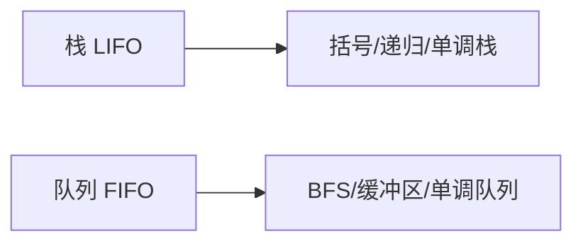

## 概述

栈和队列都是受限的线性结构。它们不强调“任意位置访问”，而是强调“元素进入和离开的顺序”。

- 栈：后进先出，像一摞盘子；
- 队列：先进先出，像排队办事。

这两个结构看似简单，却是递归、表达式解析、BFS、任务调度、单调栈和单调队列的基础。

> 前置知识
> - **LIFO / FIFO**：栈后进先出，队列先进先出
> - **数组实现**：注意 `push/pop` 与 `shift/unshift` 的成本
> - **单调结构**：用栈或队列维护有序候选集

---

## 问题定义

栈和队列解决的是“顺序控制”问题。

| 结构 | 入 | 出 | 顺序 |
| --- | --- | --- | --- |
| 栈 | `push` | `pop` | 后进先出 |
| 队列 | `enqueue` | `dequeue` | 先进先出 |

如果问题关心“最近加入的元素”，通常想到栈；如果问题关心“最早等待的元素”，通常想到队列。

---

## 核心原理：分步图解

### 栈

```text
push 1 -> [1]
push 2 -> [1, 2]
pop    -> [1]，返回 2
```

栈只操作同一端，因此入栈和出栈都是 O(1)。

### 队列

```text
enqueue 1 -> [1]
enqueue 2 -> [1, 2]
dequeue   -> [2]，返回 1
```

队列从尾部进入、从头部离开。用 JavaScript 数组直接 `shift` 会移动元素，因此更好的实现是维护头指针。

### 单调结构

单调栈和单调队列会在插入时删除不可能再成为答案的元素：

```text
保持从大到小：
入队 3: [3]
入队 1: [3, 1]
入队 2: [3, 2]  // 1 被移除
```

这类结构把很多“向左/向右找第一个更大值”的问题优化到 O(n)。

---

## 基本操作与复杂度

| 结构 | 操作 | 时间复杂度 | 说明 |
| --- | --- | --- | --- |
| 栈 | push / pop / peek | O(1) | 只操作尾部 |
| 队列 | enqueue / dequeue / peek | O(1) | 使用头尾指针 |
| 单调栈 | push / pop | 摊还 O(1) | 每个元素最多进出一次 |
| 单调队列 | push / shift | 摊还 O(1) | 维护窗口最值 |

“摊还 O(1)”的意思是：单次操作可能弹出多个元素，但每个元素整个生命周期只会被弹出一次。

---

## TypeScript 实现

### 1. 栈

```typescript
class Stack<T> {
  private readonly items: T[] = [];

  push(value: T): void {
    this.items.push(value);
  }

  pop(): T | undefined {
    return this.items.pop();
  }

  peek(): T | undefined {
    return this.items[this.items.length - 1];
  }

  get size(): number {
    return this.items.length;
  }
}
```

### 2. 队列

```typescript
class Queue<T> {
  private readonly items: T[] = [];
  private head = 0;

  enqueue(value: T): void {
    this.items.push(value);
  }

  dequeue(): T | undefined {
    if (this.head >= this.items.length) return undefined;

    const value = this.items[this.head];
    this.head++;

    if (this.head > 32 && this.head * 2 > this.items.length) {
      this.items.splice(0, this.head);
      this.head = 0;
    }

    return value;
  }

  get size(): number {
    return this.items.length - this.head;
  }
}
```

这个队列避免每次出队都 `shift`，只在头部废弃空间较多时做一次压缩。

### 3. 单调栈：下一个更大元素

```typescript
function nextGreater(nums: number[]): number[] {
  const result = Array(nums.length).fill(-1);
  const stack: number[] = [];

  for (let i = 0; i < nums.length; i++) {
    while (stack.length > 0 && nums[i] > nums[stack[stack.length - 1]]) {
      const index = stack.pop()!;
      result[index] = nums[i];
    }

    stack.push(i);
  }

  return result;
}
```

栈里存的是下标，而不是值，因为答案要写回原位置。

---

## 工程优化：避免误用数组 API

在 JavaScript 中，数组尾部操作很快：

```typescript
arr.push(value);
arr.pop();
```

但头部操作会移动元素：

```typescript
arr.shift();
arr.unshift(value);
```

如果队列规模较小，直接使用 `shift` 可以接受；如果队列在热路径上，应该使用头指针、环形数组或双端队列实现。

---

## 应用与局限

### 典型应用

- 栈：括号匹配、函数调用、撤销操作、DFS；
- 队列：BFS、任务调度、消息缓冲；
- 单调栈：下一个更大元素、柱状图最大矩形；
- 单调队列：滑动窗口最大值。

### 局限性

- 栈和队列不支持中间元素高效访问；
- 队列用普通数组实现时要避免频繁 `shift`；
- 单调结构只适合能淘汰无效候选的问题；
- 栈深度过大时，递归调用可能触发调用栈限制。

---

## 总结



- 栈是后进先出，队列是先进先出。
- 它们的价值在于控制处理顺序，而不是随机访问。
- 队列实现应避免频繁头部删除导致 O(n) 搬移。
- 单调栈和单调队列通过删除无效候选把问题优化到线性时间。
