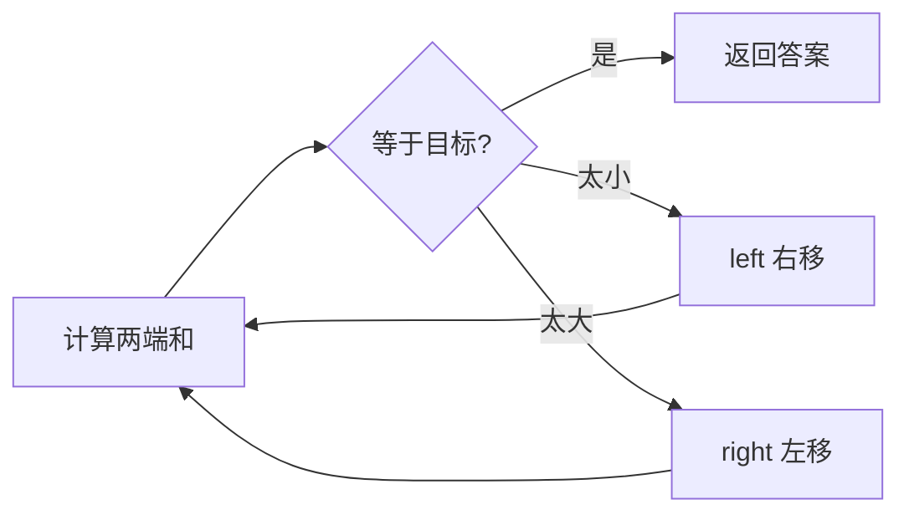
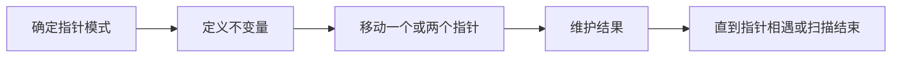

## 概述

**数组双指针** 用两个下标同时维护数组中的位置关系。它常把原本需要嵌套循环的枚举，优化为一次或少数几次线性扫描。

> 前置知识
> - **数组下标**：指针本质是下标变量
> - **有序性**：左右指针常依赖数组排序
> - **不变量**：明确两个指针之间的区间含义

---

## 问题定义

给定数组或字符串，通过两个指针的相对移动，完成查找、合并、反转、去重或原地修改。

| 要素 | 说明 |
|------|------|
| 输入 | 数组、目标值、两个有序序列或字符串 |
| 输出 | 下标、修改后的数组长度、合并结果或最优值 |
| 指针模式 | 左右指针、快慢指针、分离指针 |
| 典型收益 | 将 O(n²) 枚举降为 O(n) 扫描 |

---

## 核心原理：分步图解

以有序数组两数之和为例：

```text
nums:   2   7   11   15
target: 9
        L            R
```

如果 `nums[left] + nums[right]` 太大，就右指针左移；太小，就左指针右移。



这种移动成立的前提是数组有序，移动后能安全排除一批不可能答案。

---

## 算法精细步骤

```
算法：TwoPointers(nums, target)
输入：有序数组 nums，目标 target
输出：满足条件的两个位置

1. left ← 0, right ← nums.length - 1
2. while left < right:
3.     sum ← nums[left] + nums[right]
4.     if sum == target，返回答案
5.     if sum < target，left ← left + 1
6.     else right ← right - 1
7. 返回未找到
```

**复杂度分析**：

| 模式 | 时间复杂度 | 空间复杂度 | 说明 |
|------|------|------|------|
| 左右指针 | O(n) | O(1) | 两端向中间移动 |
| 快慢指针 | O(n) | O(1) | 同向扫描，常用于原地修改 |
| 分离指针 | O(m + n) | O(m + n) 或 O(1) | 合并两个序列 |
| 三数之和 | O(n²) | O(1) | 排序后固定一个数再双指针 |

---

## TypeScript 实现

### 1. 两数之和 II

```typescript
function twoSum(numbers: number[], target: number): number[] {
  let left = 0;
  let right = numbers.length - 1;

  while (left < right) {
    const sum = numbers[left] + numbers[right];
    if (sum === target) return [left + 1, right + 1];
    if (sum < target) left++;
    else right--;
  }

  return [-1, -1];
}
```

### 2. 反转字符串

```typescript
function reverseString(s: string[]): void {
  let left = 0;
  let right = s.length - 1;

  while (left < right) {
    [s[left], s[right]] = [s[right], s[left]];
    left++;
    right--;
  }
}
```

### 3. 删除有序数组重复项

```typescript
function removeDuplicates(nums: number[]): number {
  if (nums.length === 0) return 0;

  let slow = 0;
  for (let fast = 1; fast < nums.length; fast++) {
    if (nums[fast] !== nums[slow]) {
      slow++;
      nums[slow] = nums[fast];
    }
  }

  return slow + 1;
}
```

### 4. 移动零

```typescript
function moveZeroes(nums: number[]): void {
  let write = 0;

  for (let read = 0; read < nums.length; read++) {
    if (nums[read] !== 0) {
      [nums[write], nums[read]] = [nums[read], nums[write]];
      write++;
    }
  }
}
```

### 5. 合并两个有序数组

```typescript
function merge(nums1: number[], m: number, nums2: number[], n: number): void {
  let p1 = m - 1;
  let p2 = n - 1;
  let tail = m + n - 1;

  while (p2 >= 0) {
    if (p1 >= 0 && nums1[p1] > nums2[p2]) {
      nums1[tail--] = nums1[p1--];
    } else {
      nums1[tail--] = nums2[p2--];
    }
  }
}
```

### 6. 三数之和

```typescript
function threeSum(nums: number[]): number[][] {
  nums.sort((a, b) => a - b);
  const result: number[][] = [];

  for (let i = 0; i < nums.length - 2; i++) {
    if (i > 0 && nums[i] === nums[i - 1]) continue;

    let left = i + 1;
    let right = nums.length - 1;

    while (left < right) {
      const sum = nums[i] + nums[left] + nums[right];
      if (sum === 0) {
        result.push([nums[i], nums[left], nums[right]]);
        while (left < right && nums[left] === nums[left + 1]) left++;
        while (left < right && nums[right] === nums[right - 1]) right--;
        left++;
        right--;
      } else if (sum < 0) {
        left++;
      } else {
        right--;
      }
    }
  }

  return result;
}
```

---

## 工程优化：先定义指针不变量

| 模式 | 不变量 | 常见用途 |
|------|------|------|
| 左右指针 | 答案在 `[left, right]` 内 | 有序查找、回文、反转 |
| 快慢指针 | `[0, slow]` 是已处理有效区间 | 去重、过滤、移动元素 |
| 分离指针 | 两个输入各自有序推进 | 合并数组、归并排序 |
| 前后写指针 | 尾部空间未被覆盖 | 原地合并 |

双指针代码不要只记模板，要说明为什么移动某个指针不会漏掉答案。

---

## 应用与局限

### 典型应用

- 有序数组查找两数之和
- 原地去重、移动零、删除元素
- 回文判断、字符串反转
- 合并有序数组、三数之和

### 局限性

| 局限 | 说明 |
|------|------|
| 常依赖有序性 | 无序数组通常需要先排序或用哈希表 |
| 移动规则需证明 | 不能安全排除候选时会漏答案 |
| 排序会改变输入 | 三数之和等题目要注意是否允许原地排序 |

---

## 总结



**核心要点**：

1. 双指针的价值是用线性移动替代重复枚举。
2. 左右指针通常依赖有序性，快慢指针常用于原地修改。
3. 每次移动指针前，都要能证明被跳过的状态不可能成为答案。
4. 三数之和是“排序 + 固定一个数 + 左右指针”的经典组合。
